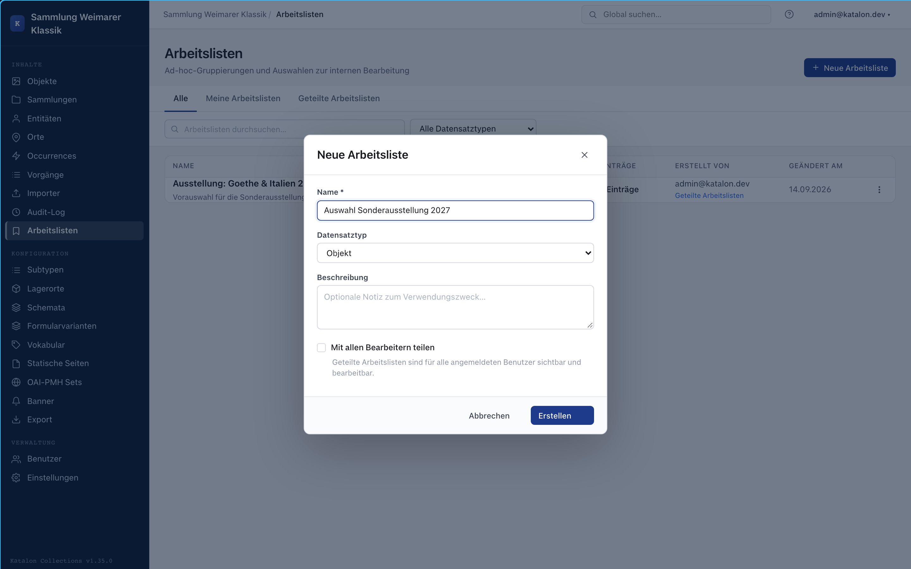

Work lists are freely assembled, personal or shared collections of record references — e.g. a selection for an upcoming exhibition, a checklist of open conservation cases, or a hold list. Unlike the curatorial **Collections** (a core type of its own), work lists are purely internal, not visible in the portal, and schema-free.

They are managed in the admin UI under **Work Lists**.

---

## Creating a work list

1. Click **New Work List**.
2. Enter a name and, optionally, a description.
3. Optionally set a **record type** to which the list stays restricted — without a restriction, the list can contain records of all seven core types mixed together.
4. Enable **Share with all editors** so the list becomes visible and editable for all logged-in users. Without this option, the list is only visible to the person who created it (**My Work Lists**).

---

## Adding and managing records

- In any list view (Objects, Entities, Places, Occurrences, Procedures, Collections), select one or more records and choose **Add to Work List** — either pick an existing list or create a new one directly.
- Within a work list, entries can be manually reordered with **Move up/down** and given a free-text **note** (e.g. processing status or remark).
- **Remove** only takes a record out of the work list — the record itself stays unchanged. The same applies when **deleting the entire work list**: the records it contains are left untouched.

---

## Batch editing from a work list

The **Batch Editing** button applies the same bulk editing available in the regular list views to all records in a work list (set status, set/append/clear field, add/remove relation) — see [Batch Editing](batch-bearbeitung). This is especially useful when the affected records were gathered from several separate searches or filters and can't be captured by a single list filter.
