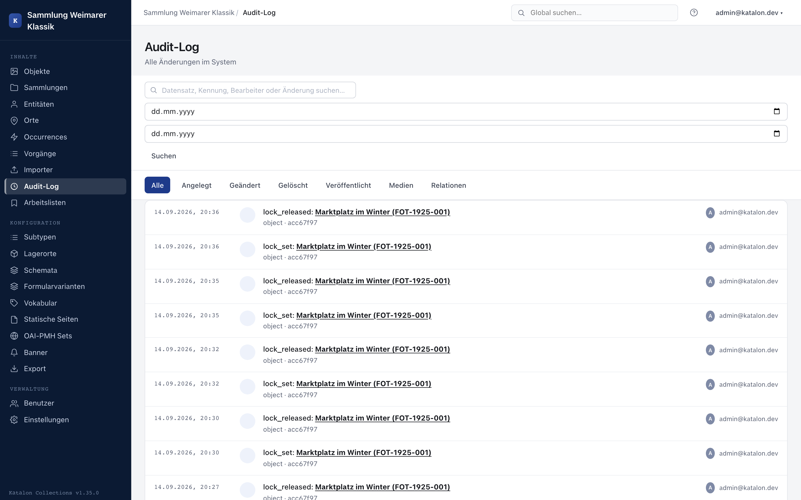

The audit log records every change to holdings data without gaps: who changed what, and when — including the old and new value for each field. It cannot be disabled and cannot be manipulated by editors.

The cross-type overview is available in the admin UI under **Audit Log**; each individual record also shows its own history in the edit form.

---

## Logged actions

| Action | Description |
|---|---|
| **Created** | New record created. |
| **Changed** | Metadata field(s) changed — with old/new value per field. |
| **Deleted** | Record deleted. |
| **Published** | Status change (e.g. draft → published). |
| **Media added / changed / deleted** | Changes to attached media files. |
| **Relation added / changed / deleted** | Relations to other records. |
| **AI schema assistance** | Schema changes suggested by the AI and accepted, including the model used and token consumption. |
| **AI translation** | Accepted AI translation proposal for a multilingual field, including the model used, source, and target language. |

Batch edits appear as individual entries per affected record, but share a common batch identifier — see [Batch Editing](batch-bearbeitung).

---

## Marking AI-generated field values

Independent of the audit log, Katalon marks individual field values generated by the AI assistant (text suggestion or translation) directly in the edit form with a small **"AI"** icon next to the field. Hovering over it shows the model name and creation timestamp (`AI-generated (<model>) on <timestamp>`).

This marker (`ai_provenance`) is available for all seven core types: objects, entities, places, occurrences, procedures, collections, and storage locations.

---

## Filtering and searching

- **Full-text search** across record labels and changed values.
- **Date range** via from/to date.
- **Action type** filter bar (All, Created, Changed, Deleted, Published, Media, Relation).
- Results are paginated (50 entries per page).

Clicking the record name in an entry opens the affected record directly in the editor — even across record types (e.g. from an entity to an object linked via a relation).

---

## Retention

Audit log entries are not automatically deleted or rotated. They remain even after the associated record is deleted, thereby also documenting the time of deletion and who performed it.
