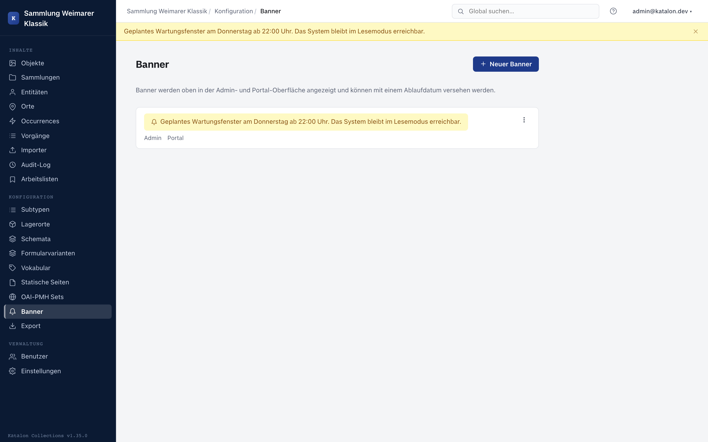

Banners are short, color-highlighted notice messages displayed above the admin interface and/or in the public portal — e.g. for a planned maintenance window, an import lock, or an announcement.

They are managed in the admin UI under **Configuration → Banner**.

---

## Creating a banner

1. Click **New Banner**.
2. Enter the **message text**.
3. Choose a **color**: blue (information), yellow (warning), red (critical), green (success/notice).
4. Set the display location:
   - **Show in admin** — appears for logged-in editors and administrators.
   - **Show in portal** — appears for visitors of the public catalog.
5. Optionally set an **expiry date**. Once that point is reached, the banner automatically stops being shown, without needing to be manually deactivated.
6. **Save**.

Multiple active banners are shown at the same time.

---

## Activating, deactivating, deleting

- The **status toggle** in the banner list (de)activates a banner immediately, without changing its text.
- Expired banners (expiry date in the past) remain in the list but are no longer shown — they can still be edited or deleted.
- The trash button deletes a banner irrevocably.
