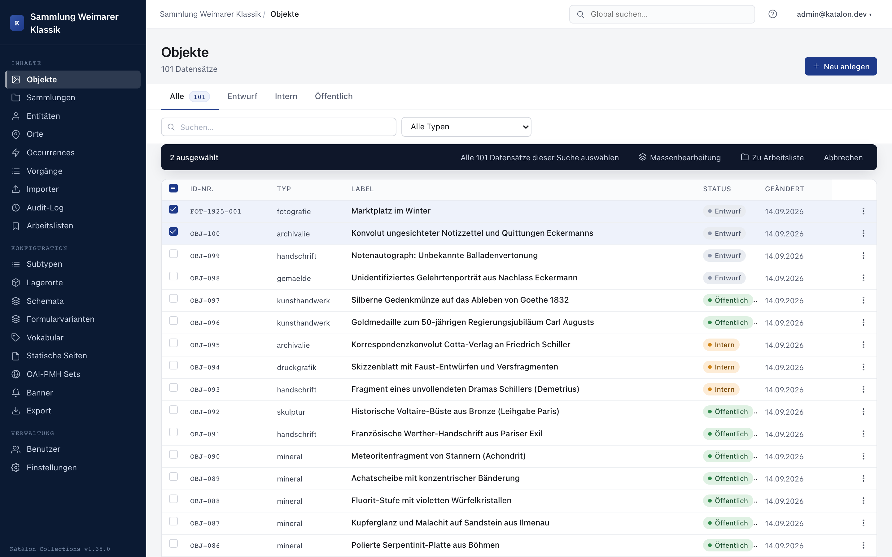
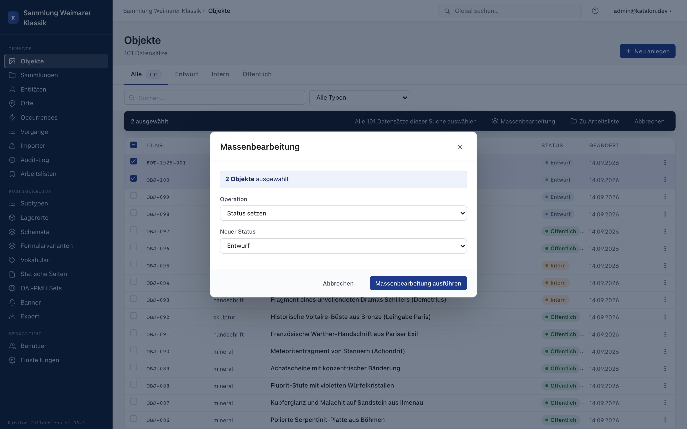

## Overview

Batch editing lets you apply the same operation to many records at once, without opening each record individually. It is available in all list views: Objects, Entities, Places, Occurrences, Procedures, and Collections.

## Opening a single record

Click the label value of a record to open it directly. For further actions, the three-dot menu on the right edge of the table row remains available.

:::note[Available from version 1.22.0]
:::

## Making a selection

1. Select individual records in the left column of the table.
2. Use the checkbox in the table header to select all records on the current page.
3. If there is more than one page of results, the action bar shows the link **"Select all N records from this search"**. This extends the selection across pages to all matches of the current filter/search.
4. Click **Batch Editing**.

## Supported operations

| Operation | Description |
|---|---|
| **Set status** | Changes the publication status of all selected records. |
| **Set field** | Overwrites a single metadata field. |
| **Append field** | For repeatable fields, adds a value without deleting existing ones. |
| **Clear field** | Resets the field to an empty state. |
| **Add relation** | Links all selected records to a target record. |
| **Remove relation** | Removes an existing link to a target record. |

## Safety notice

From **50 selected records** onward, a warning appears. The action cannot be undone automatically. If you need a restore point, manually create snapshots of the affected records beforehand.

Every batch edit is logged in the **Audit Log** per record, with a shared `batch_job_id`.

## Asynchronous processing

From **100 selected records** onward, the operation runs in the background via Celery. The frontend displays the task ID. Refresh the list to see the result.

Once finished, the person who started the batch edit additionally receives an email with the result figures, provided the operator has configured email sending.
