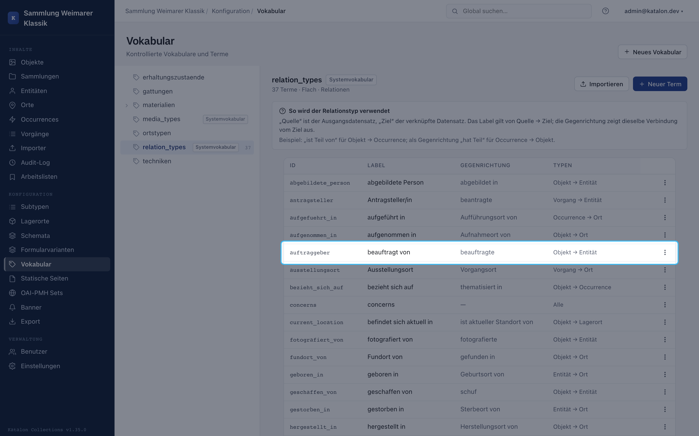
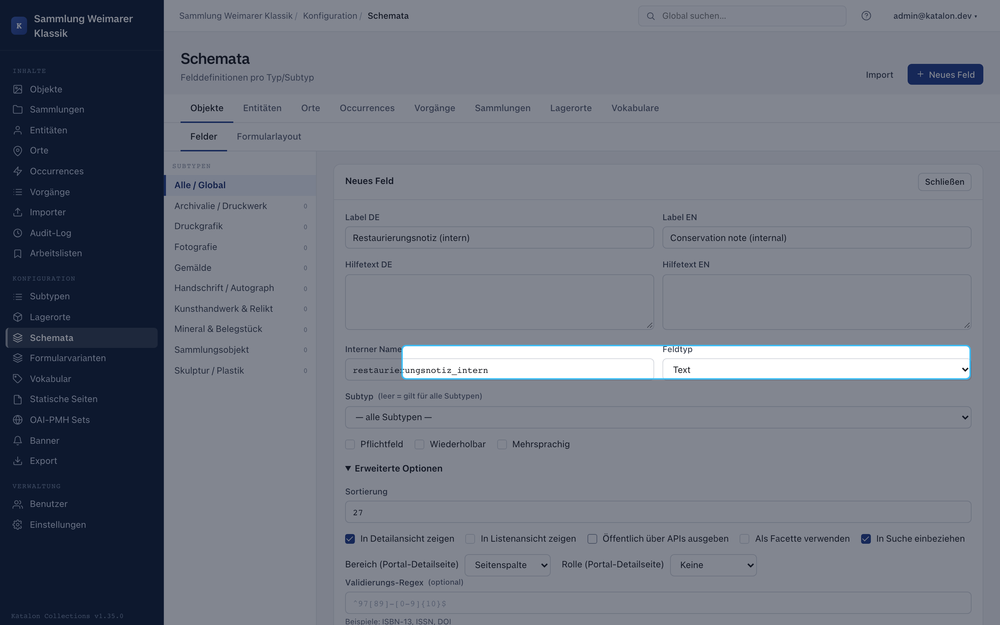
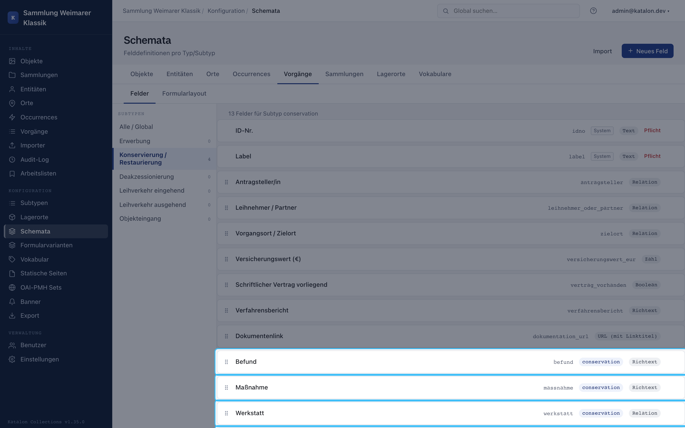
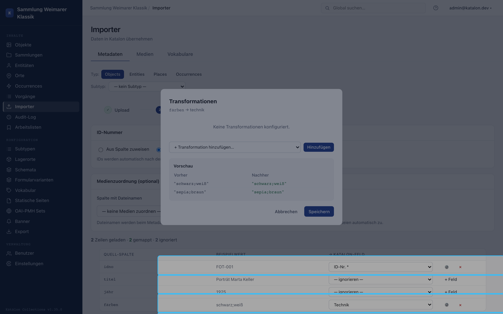

These examples build on the [walkthrough for setting up your own collection](/katalon-docs/en/getting-started/eigene-sammlung). Each recipe describes a small, reusable configuration.

## Multiple people for one photograph

A photograph can have a photographer, a commissioner, and a depicted person. Create separate types for this in the relation vocabulary, e.g. "photographed by", "commissioned by", and "depicts". Then either create one relation field per role, if the roles are a permanent part of the form, or use the Relationships card for rare individual cases.

The "Photographer" field can be repeatable. Every selected entity is linked with the same relation type. Different roles need different relation types, not a note in the person's name.

## Keeping internal information separate from public metadata

For conservation notes, internal contact details, or provenance that hasn't been verified yet, create a dedicated schema field and disable **Output publicly via APIs**. The value stays visible in the admin UI but is not output to the portal, anonymous API responses, OAI-PMH, or IIIF.

Display on a portal detail page is not an access control mechanism. The public-output option is what decides whether a value leaves the protected area at all.

## Recording imprecise dating

The date field stores concrete ISO values such as `1923`, `1923-05`, or `1923-05-14`. For "around 1920" or a range, don't invent a free-text date. Create a `dating` field group containing a date field and a vocabulary field `type` with values such as `exact`, `circa`, `before`, `after`, and `undated`. For a range, two date fields `from` and `to` are clearer.

The full configuration, including for BCE dates, is documented in [Schema Management](/katalon-docs/en/administration/schema#cookbook-datierungstyp-unscharfequalifizierte-datierung).

## Acquisition and conservation as procedures

For an acquisition procedure, first create an object with holdings status **In progress**. In the `acquisition` procedure type, fields such as acquisition method, purchase price, or resolution number can be created. On completion, Katalon suggests the object status **Active**.

For a conservation treatment (`conservation`), findings, measures, and the workshop are captured as fields and relationships. Multiple conservation treatments on the same object are possible. On completion, Katalon does not suggest a holdings status for this type, since a conservation treatment does not automatically determine availability.

## Custom procedure types for local workflows

An institution might, for instance, create `condition_check` for a condition survey. Under **Configuration → Subtypes**, create a procedure type with a German and English label; then, in the schema, create fields such as check date, result, and next check only for this type.

Custom procedure types have no automatic holdings status and no lock against parallel procedures. If the workflow needs a rule, it must be organized by the team on a professional basis, or added later as a dedicated product feature.

## Preparing a tabular import without data loss

Before an import, create the target fields and vocabularies. In the importer, map columns, review the preview, and always run a **dry run** first. Only import once required fields, delimiters, and transformations are correct.

For a field with multiple color values in one cell, the `split` transformation with `;` is suitable. For a controlled vocabulary, import the terms first and then use `vocab_map`. Relationships are not created by a name in a CSV column; that requires a matching resolution or creation rule in the import flow.

The individual import steps are documented under [Metadata & Media Import](/katalon-docs/en/administration/import).

## Machine-readable licenses and rights statements (ECHOES / FAIR)

International metadata and interoperability standards (such as **ECHOES D6.2** REQ-META-002, Europeana, Deutsche Digitale Bibliothek, or open-access guidelines) require a **machine-readable license or rights statement** for every published record.

### Why not a free-text field (`text`)?

A plain text field (e.g. `text` with values like "CC-BY 4.0", "Creative Commons", "Public Domain", or "Free for academic use") is **not machine-readable**:
- External harvesters, OAI-PMH aggregators, and repositories cannot reliably parse spelling variations, typos, or different language variants.
- Semantic export interfaces (JSON-LD, RDF/Turtle, SPARQL) cannot produce a standardized license predicate with a dereferenceable URI.

### Recommended modeling: controlled vocabulary (`vocab`)

The **`vocab`** field type is used for license information. This strictly ties data entry to quality-assured terms with canonical URIs.

#### Step 1: Create a license vocabulary

1. Open the admin UI and navigate to **Configuration → Vocabularies**.
2. Click **New Vocabulary**:
   - **Name:** `licenses`
   - **Label (DE):** `Lizenzen & Nutzungsrechte`
   - **Label (EN):** `Licenses & Rights`
3. Create the licenses permitted at your institution as terms. In the **Canonical URI** field, enter the official license URI from Creative Commons or RightsStatements.org:

| Term (Label EN) | Label DE | Canonical URI (`canonical_uri`) | Meaning / recommendation |
|---|---|---|---|
| **Public Domain Dedication (CC0 1.0)** | Gemeinfrei (CC0 1.0) | `https://creativecommons.org/publicdomain/zero/1.0/` | Completely rights-free, metadata standard |
| **Attribution (CC BY 4.0)** | Namensnennung (CC BY 4.0) | `https://creativecommons.org/licenses/by/4.0/` | Standard open access |
| **Attribution-ShareAlike (CC BY-SA 4.0)** | Namensnennung - Weitergabe unter gleichen Bedingungen (CC BY-SA 4.0) | `https://creativecommons.org/licenses/by-sa/4.0/` | Derivative works under the same license |
| **Attribution-NonCommercial (CC BY-NC 4.0)** | Namensnennung - Nicht kommerziell (CC BY-NC 4.0) | `https://creativecommons.org/licenses/by-nc/4.0/` | Non-commercial reuse only |
| **In Copyright (InC 1.0)** | In Copyright (InC 1.0) | `http://rightsstatements.org/vocab/InC/1.0/` | Copyright protected, no reuse without permission |
| **No Copyright - Non-Commercial (NoC-NC 1.0)** | Urheberrechtsschutz erloschen (NoC-NC 1.0) | `http://rightsstatements.org/vocab/NoC-NC/1.0/` | Public domain, contractually restricted to non-commercial reuse |

#### Step 2: Define the schema field

1. Navigate to **Configuration → Schemas** and select the primary type (e.g. **Objects**).
2. Click **New Field**:
   - **Name:** `license`
   - **Label (DE):** `Lizenz`
   - **Label (EN):** `License`
   - **Field type:** `vocab`
   - **Vocabulary:** Select `Licenses & Rights`.
   - **Output publicly via APIs:** Leave enabled.
3. Under **Advanced options → Metadata export**:
   - Map the field to the Dublin Core element `dcterms:license` (or `dc:rights`).

#### Step 3: Rights information for media (digitizations)

Media records (images, scans, digitizations) already have a built-in field for license and rights holder in Katalon. If an analog object and its digitization are subject to different rights (e.g. the historical object is public domain, the reproduction photo is licensed CC BY), the object's license is captured via the `license` schema field, and the image's license is captured directly on the media record.
