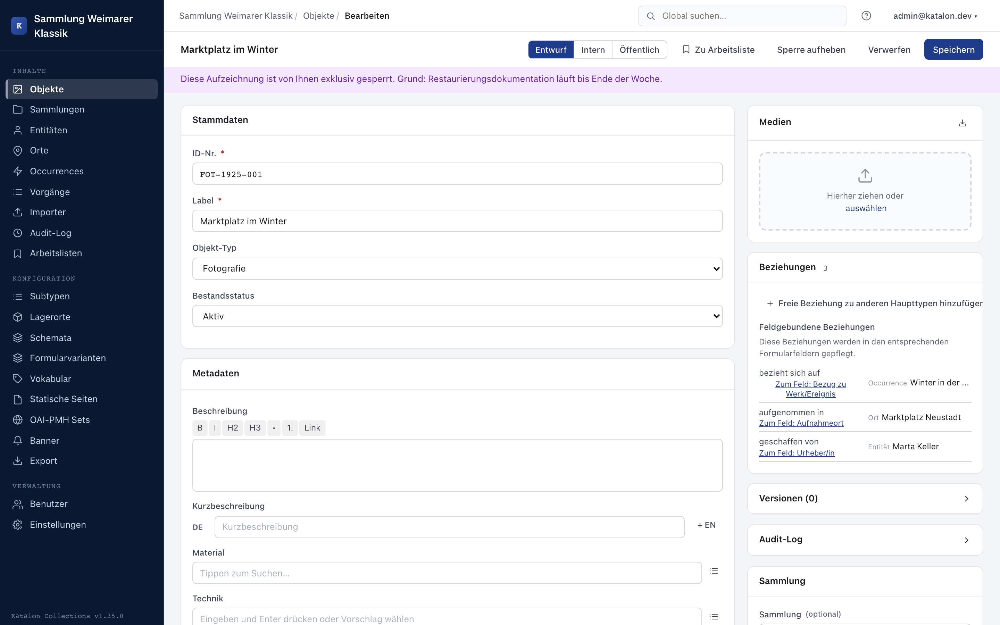

## Overview

Besides the automatic editing indicator (see below), there is a manual, persistent lock: locking a record actively prevents other users from saving it — e.g. during extended research, coordination with external parties, or whenever a record must remain untouched for professional reasons.

:::note[Available from version 1.26.0]
:::

## Permission

Setting a lock is its own permission (**Set manual lock**) and is granted per role under **Management → Users → Role Permissions**. Without this permission, the **Lock** button does not appear in the edit form.

Administrators and superusers can release any lock regardless of this permission (see [Forcibly releasing a lock](#forcibly-releasing-a-lock)).

## Setting a lock

1. Open the record in the edit form.
2. Click **Lock** at the top of the form.
3. Optionally enter a reason and/or set an expiry date.
4. Confirm with **Lock**.

The record then shows a purple notice bar above the form with the user, reason, and — if set — expiry date.

## Effect of the lock

While a lock is active, the server rejects every save attempt by other users with a conflict error, regardless of the channel (form or API). The lock applies to all seven record types (Objects, Entities, Places, Occurrences, Procedures, Collections, Storage Locations).

The person who set the lock can continue to edit and save the record.

## Releasing a lock

The person who set the lock releases it again via the same button (now labeled **Release lock**). If an expiry date is set, the lock automatically expires once it is reached, even without manually releasing it.

## Forcibly releasing a lock

Administrators and superusers can release someone else's lock at any time, for example when the person who set it is unreachable. Forced release is available independently of the **Set manual lock** permission.

## Distinction from the editing indicator

The exclusive lock is independent of the automatic editing indicator, which shows when another user currently has the same record open. This indicator is purely informational and disappears as soon as the form is closed — it does not prevent saving. Only the manual lock described in this chapter actively blocks saving.

## Locks in the list view

In list views, a purple lock pill marks each locked record. Hovering over the pill shows who locked it and the reason.
