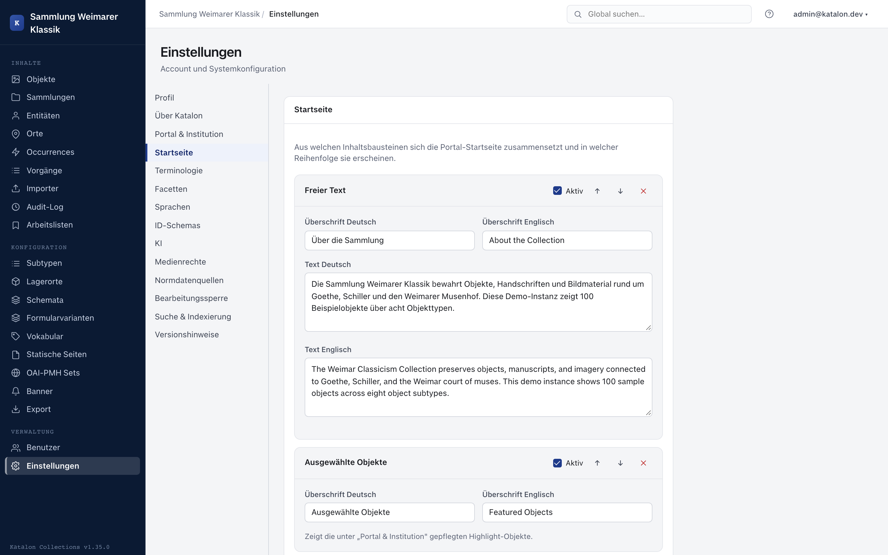

Settings bundle global, non-schema-related system configuration. In the admin UI, they are organized into sections under **Settings**; most sections are only visible to administrators.

Some sections are documented in detail on their own pages and are only linked here:

- **Facets** → [Setting up facets](../integration/portal-suche#facetten-einrichten)
- **Languages** → [Multilingual Support](mehrsprachigkeit)
- **Authority data sources** → [Authority Data & Linked Data](normdaten)
- **Edit lock** → [Locking a Record](datensatz-sperren)
- **Linked Data & SPARQL** → [SPARQL Endpoint (Oxigraph)](../integration/sparql)

The remaining sections are described below.

---

## Profile

Personal account settings: change email and password, generate/revoke your own **API keys** (for programmatic read access via the `X-API-Key` header), and restart the onboarding tour.

## Portal & Institution

Branding and basic configuration of the public portal:

- **Site title, subtitle, hero text**, and **logo** (upload directly in the form).
- **Placeholder image** for records without media.
- **Featured objects** on the homepage (list of record IDs).
- **Searchable record types** in the portal navigation (Objects, Entities, Places, Occurrences).
- **Accent color** as well as individual color tokens (header background/text, page and panel background) for simple custom theming without CSS knowledge.
- **Position of the detail page sidebar** (left/right).

## Homepage

:::note[Available from version 1.28.0]
The portal homepage can be assembled from configurable content blocks, instead of being fixed to an object-centric entry point.
:::

Under **Settings → Homepage**, the public homepage can be assembled from an ordered list of blocks. Blocks can be added, reordered via arrow buttons, toggled on/off, and removed. Available block types:

- **Free text** — multilingual intro text (German/English), e.g. a welcome message or institutional context.
- **Featured objects** — shows the Featured Objects maintained under **Portal & Institution**; here only the maximum number is configurable.
- **Latest objects** — the most recently created objects, with a configurable count.
- **Collections** — top-level collections, all collections, or a manually selected set by collection ID.

Each block can have its own multilingual heading. If a referenced collection is missing or the list of Featured Objects is empty, the block is simply skipped — the homepage remains usable.

## Terminology

:::note[Available from version 1.29.0]
The labels shown in the portal for the core types can be customized per installation, without changing the data model or the API.
:::

Under **Settings → Terminology**, a custom label can be set for each core type visible in the portal — Objects, Entities, Places, Occurrences, Collections — separately for singular and plural, and per language (German/English). A library installation could, for instance, consistently display "Work"/"Works" instead of "Object"/"Objects", while a museum might use "Exhibit"/"Exhibits" — internally it remains the same record type `object`.

The configured terms are automatically used everywhere in the portal where the respective record type is named: main navigation, homepage, search results, facets, and detail pages. An empty field falls back to the built-in default label; **Reset to default** completely removes a saved customization for a type.

## ID Schemas

For each primary type, an **ID schema** with placeholders can be defined, from which the next ID is automatically suggested when creating a new record, e.g. `ulb_x_{counter:05d}`.

| Placeholder | Meaning |
|---|---|
| `{counter}` | Sequential number |
| `{counter:05d}` | Sequential number, zero-padded |
| `{year}` | Current year |
| `{type}` | Type abbreviation (`obj`/`ent`/`pla`/`occ`/`pro`) |

In addition, a **validation pattern** (regex) can be set per type, against which manually entered IDs are checked.

## AI

Global connection to an LLM (OpenAI-compatible API, e.g. OpenAI or OpenRouter) for field-related AI suggestions in the editor:

- **Base URL** and **model** (e.g. `https://api.openai.com/v1`, `gpt-4.1-mini`).
- The **API key** is stored encrypted in the database and is never returned in plain text after being set; **Test connection** checks the configuration without reference to a record.
- **Token limits**: maximum input/output tokens per request, as well as a **daily limit per user** and a **global monthly limit**, with a display of current consumption.

Every AI completion used is logged in the [Audit Log](audit-log) with the model and token consumption.

## Media Rights

Default values that are automatically copied to every new media file upon upload: **default license** (URI) and **default rights holder** (name + optional URI). Changes only affect future uploads, not existing media retroactively.

## Search & Indexing

Manually trigger Elasticsearch reindexing — necessary after major schema changes or data imports outside the regular save path. Reindexing can be triggered per record type or for the entire holdings, and runs asynchronously in the background; a status widget shows the index state.

## About Katalon

Version, license, and link information (source code, license text, documentation), as well as access to the **release notes** (changelog).

## Danger Zone

::::caution
Irreversible action — be sure to read the confirmation text before use.
::::

Hides all non-system field definitions from the schema for a chosen primary type (optionally restricted to a subtype). **Records and their stored metadata values are not deleted in the process** — they remain in the database and become visible again as soon as a field with the same technical name is created again in the schema editor. The system fields `label` and `idno` are always preserved. To confirm, the label of the affected schema must be typed exactly (case-sensitive).
