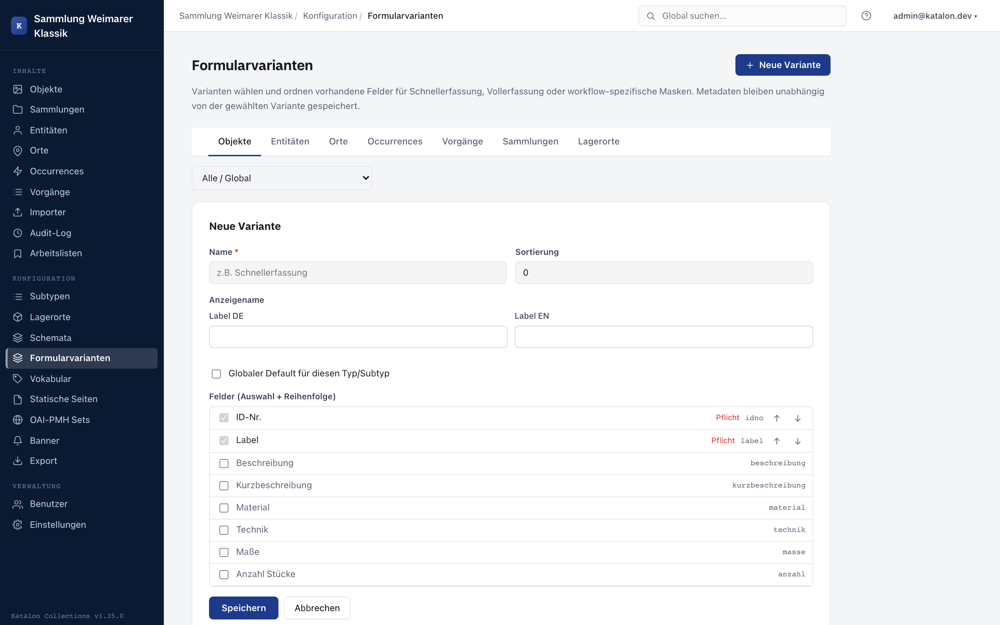

## Overview

Form variants select and order the existing schema fields of a record type for different data-entry situations — for example, a lean quick-entry form alongside the full form. They are managed in the admin UI under **Configuration → Form Variants**.

Only users with the `admin` or `superuser` role see this menu item and can create, change, or delete variants.

A form variant does **not** create new fields and does **not** create a second metadata store: it only selects a subset from the fields already defined under **Configuration → Schemas** and sets their order. A record always stores its values in the same `metadata` structure, regardless of which variant was used to capture it.

---

## Creating variants

1. Open the admin UI, select **Form Variants** under **Configuration** in the left-hand menu.
2. At the top, select the record type (Objects, Entities, Places, Occurrences, Procedures, Collections).
3. If subtypes are configured for this type, a subtype selector also appears. **All / Global** shows variants that apply regardless of subtype; a specific selection additionally shows subtype-specific fields.
4. Click **New Variant**.
5. Enter a name (internal identifier, e.g. `quick_entry`) and a German label.
6. Check off fields from the list. The arrow buttons next to each field let you adjust its order within the variant.
7. Optionally set **Global default for this type/subtype** (see below).
8. Save.

Required fields (including required fields within a group) are already checked in the field list and cannot be unchecked — a variant must not hide a field that is mandatory when saving. The backend enforces this rule independently of the UI when creating and editing a variant.

---

## Which variant is shown when entering data?

When an edit form is opened, the following priority decides which variant is active:

1. A most-recently manually chosen variant remembered for the type and subtype in the browser (per device/browser, not account-wide).
2. The role default configured for the user's own role (see below).
3. The global default for this type/subtype, if a variant is marked as such.
4. No match: the full schema, i.e. all fields — identical to the behavior without form variants.

If the editor manually selects the **Full** tab at the top of the form, that choice is remembered and is not automatically overridden by a role or global default the next time the form is opened.

### Role default

In the variant list, each variant can be checked to indicate for which roles (Administrator, Editor, Cataloger, Viewer) it should serve as the default variant. Only one variant can be marked as default per role and type/subtype combination — setting it again on a different variant automatically clears the previous role default.

---

## Where form variants apply

- In the normal edit form for existing and new records of the six record types (Objects, Entities, Places, Occurrences, Procedures, Collections).
- In the quick-entry form opened when creating relations from within another form (see the Relationships card in [Schema Management](/katalon-docs/en/administration/schema)).

Group fields are included in a variant as a whole via the group's name; individual child fields of a group cannot be selected or deselected separately.

---

## Deleting variants

A form variant can be deleted at any time. Records captured using this variant remain unchanged — their metadata is not tied to the variant. If the deleted variant was set as a role or global default, that default is simply removed.
