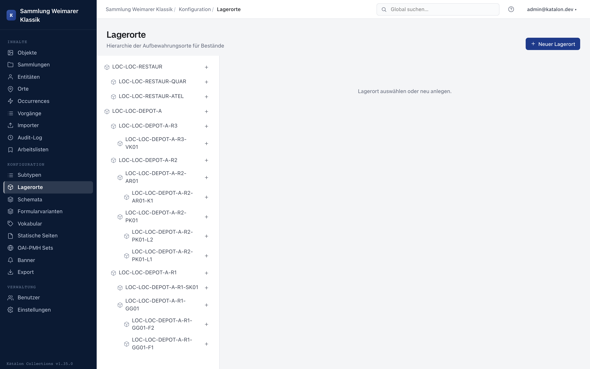

## Overview

:::note[Available from version 1.19.0]
:::

Storage locations represent where an object is physically located (depot, room, shelf, drawer, display case …), at any hierarchy depth. They are managed in the admin UI under **Configuration → Storage Locations**.

Only users with the `admin` or `superuser` role see this menu item and can create, change, or delete storage locations.

Storage locations are purely internal collection-management data. They do not appear in the portal, in public search, or in data import — for theft-prevention reasons, an object's physical location is considered internal and is never displayed publicly. Unlike Objects, Entities, Places, Occurrences, Procedures, and Collections, storage locations therefore have no draft/internal/public status field.

---

## Creating and structuring storage locations

1. Open the admin UI, select **Storage Locations** under **Configuration** in the left-hand menu.
2. In the tree view on the left, click **New Storage Location** (root level) or **Sub-entry** on an existing entry.
3. Fill in the fields in the form on the right and save.

Storage locations can be nested to any depth (e.g. depot → room → shelf → compartment). A storage location without a parent entry appears as a root node in the tree. When moving an entry via **Parent Storage Location**, the system prevents cycles — an entry cannot become its own ancestor.

---

## Fields

| Field | Required | Description |
|---|---|---|
| Inventory number / ID | Yes | Unique identifier of the storage location. Must be filled in when saving, unless an automatic numbering scheme is configured for storage locations under **Settings → ID Schemas** — in that case the ID is assigned automatically when creating a new entry. |
| Storage location type | No | Classifies the storage location by kind (e.g. depot, shelf, drawer, display case). New types are created under [Managing Subtypes](/katalon-docs/en/administration/subtypen) for the "Storage Locations" area, and enable type-specific additional fields. |
| Parent storage location | No | Determines the position in the hierarchy. Leave empty for a root node. |

In addition to these fixed fields, the form shows all additional fields configured for the selected storage location type, see [Schema Management](/katalon-docs/en/administration/schema) — e.g. capacity, climate conditions, or photo documentation of the shelf.

---

## Assigning objects to a storage location

The assignment does not happen in the storage location form, but on the object itself:

1. Open the object record.
2. Open the **Assigned Storage Locations** card in the sidebar.
3. Click **Add**, select the desired storage location in the search field (the list shows existing storage locations as soon as you click into the field; further input filters the list), and choose a relationship type.

Two relationship types are provided:

- **Normal location** (`normal_location`) — the object's regular storage location.
- **Current location** (`current_location`) — the location where the object currently is, if it differs from the normal location (e.g. during a loan, exhibition, or conservation treatment).

An object can have several storage location assignments at the same time. An object's location history can be traced via the relationship's audit log — every change, every addition, and every removal of an assignment is logged.

The "Assigned Storage Locations" card only appears if at least one storage location has been created in the system. Institutions that don't use storage location management see no trace of the feature in the object form.

---

## Deleting storage locations

Deleting a storage location that is still linked to objects prompts for confirmation, since existing assignments will be deleted along with it.

## Trash

:::note[Available from version 1.38.0]
:::

Administrators can open **Trash** at the top right. Deleted storage locations appear there separately from the active hierarchy. The action menu lets them **restore** a location or, after an additional confirmation, **delete it permanently**. Permanent deletion cannot be undone.
