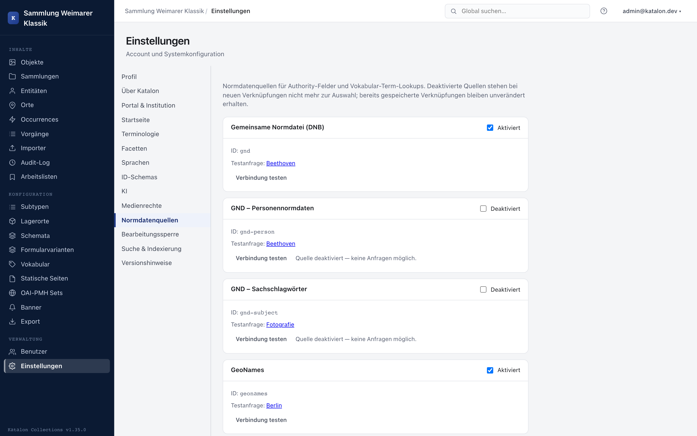

Katalon connects museum cataloging with Linked Open Data (LOD). Through the authority system, records can be linked directly during data entry with normalized identifiers and external thesauri. Vocabularies support canonical URIs and SKOS concordances.

---

## Integrated authority sources

Katalon ships with pre-built adapters for the most important international authority files and specialist vocabularies:

| Source | ID | Description & API |
|---|---|---|
| **GND** | `gnd` | Integrated Authority File of the German National Library via lobid.org (persons, corporate bodies, subject headings, geographic entities). Active by default. |
| **Wikidata** | `wikidata` | Structured knowledge base by Wikimedia. Worldwide entities of all kinds with direct cross-links. |
| **GeoNames** | `geonames` | Geographic database with worldwide place names and coordinates. |
| **VIAF** | `viaf` | Virtual International Authority File (merges national authority files). |
| **Getty AAT** | `aat` | Art & Architecture Thesaurus of the Getty Research Institute via SPARQL. |
| **Getty TGN** | `tgn` | Thesaurus of Geographic Names of the Getty Research Institute via SPARQL. |
| **ICONCLASS** | `iconclass` | Iconographic classification system for art and cultural history. |

---

## Managing authority sources

Sources are managed in the admin UI under **Settings → Authority Sources**:



1. Each source has a toggle to **enable / disable** it.
2. **Test connection** makes Katalon run a live query against the external API and shows the result or error messages directly.
3. **API-specific notes:**
   - **GeoNames:** Requires a valid GeoNames username with web services enabled in the configuration.
   - **Wikidata:** Wikidata's API policy requires an identifiable user agent. Katalon assembles this automatically from `KATALON_BASE_URL` and `OAI_ADMIN_EMAIL`, or reads the `WIKIDATA_USER_AGENT` environment variable.

Only enabled sources are available for field configuration and in data-entry forms.

---

## The `authority` field type in the schema

To capture authority data in records, an `authority`-type field is created in the schema:

1. Open **Configuration → Schemas** and select the desired primary type (Object, Entity, Place, Occurrence, Procedure, Collection, or Storage Location).
2. Click **New field**.
3. Select field type `authority`.
4. Under **Authority source**, set the desired active source (e.g. `gnd`, `wikidata`, or `geonames`).
5. The field can be marked as **repeatable** if multiple authority references should be allowed.
6. The field can also be used as a **sub-field within a field group (`group`)**.

### Entry in the form

In the edit form, Katalon renders an interactive autocomplete search mask for `authority` fields:

- Entering search terms queries the external API in real time.
- Suggestions are displayed with label, short description, and external identifier.
- The selection can conveniently be confirmed via keyboard (arrow keys + Enter).
- For **GeoNames**, the exact latitude and longitude are also stored alongside name and ID. This lets Katalon display an OpenStreetMap map preview in the admin form and in the portal without a further external API call.
- Selected authority entries are rendered in the form as direct links to the original source (e.g. a link to the lobid.org or Wikidata entry).

### Stored data structure

An authority value is stored in a structured way in the JSONB metadata field:

```json
{
  "source": "gnd",
  "external_id": "118540238",
  "label": "Goethe, Johann Wolfgang von",
  "description": "deutscher Dichter, Naturforscher und Staatsmann (1749-1832)",
  "uri": "https://d-nb.info/gnd/118540238"
}
```

---

## Vocabularies & SKOS Linked Data

Katalon's controlled vocabularies are also fully integrated into the Linked Data ecosystem:

### Canonical URIs and alignments on terms

Under **Configuration → Vocabularies**, terms can be assigned persistent identifiers:

- **Canonical vocabulary URI:** Each vocabulary can carry a base URI or ConceptScheme URI (e.g. `http://vocab.getty.edu/aat/`).
- **Term URI:** Each term can have its own canonical URI (e.g. `http://vocab.getty.edu/aat/300026816`).
- **Cross-concordances (`skos:exactMatch`):** A term can hold a list of external match URIs (e.g. Wikidata and GND URIs for the same term).
- In the term table, set URIs are linked directly and visualized with info popovers.

### SKOS thesaurus import

Katalon supports direct, selective import of SKOS hierarchies and thesauri:

1. Supported formats: **Turtle (`.ttl`)**, **RDF/XML (`.rdf`, `.xml`)**, **JSON-LD (`.jsonld`)**, and **N-Triples (`.nt`)**.
2. The import can be started directly in the vocabulary editor via the **Import SKOS** button, or in the **Import → Vocabularies** area.
3. **Selective import for large thesauri:**
   - Large vocabularies such as the Getty AAT comprise tens of thousands of terms. To import only relevant sub-areas, a **top concept URI** (e.g. the node for *oil paints*) can be specified. Katalon recursively traverses the graph and imports only this branch.
   - Alternatively, filtering can be done by a **ConceptScheme URI**.
   - Limits for maximum hierarchy depth (`max_depth`) and maximum number of terms (`max_terms`) protect against memory overflow.
4. **What is imported:**
   - Preferred labels (`skos:prefLabel`) in multiple languages (German, English, etc.).
   - Alternative labels (`skos:altLabel`) in the term metadata.
   - Exact matches (`skos:exactMatch`) as concordances.
   - Hierarchical relations (`skos:broader` / `skos:narrower`) as parent-child structure.
