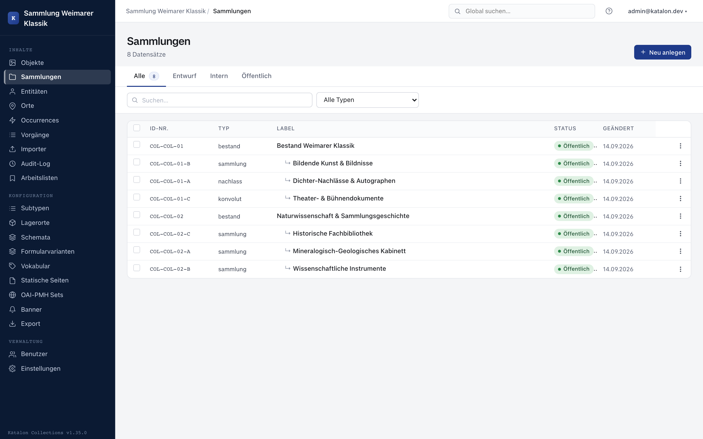

:::note[Available from version 1.18.0]
:::

Collections represent the curatorial and provenance-historical structure of an institution (e.g. an estate, a modern-art collection, a sub-holding of graphic works). In Katalon they are a standalone primary type with full schema, hierarchy, and subtype support.

Management happens in the admin UI under **Collections**.

---

## Structuring collections and holdings

1. Open the admin UI and select **Collections** in the main menu.
2. Click **New collection** in the collection list.
3. Enter title, unique ID number, and desired metadata.
4. For hierarchical holdings, select the parent node via the **Parent collection** field (e.g. *Müller holding* → *Photographs sub-holding* → *Portraits series*).

The collection list (`#collections-list`) automatically displays hierarchical collections indented as a tree view, as long as no filter, search, or manual sorting is active.

When moving or reparenting a collection via the **Parent collection** field, Katalon prevents cyclical dependencies (a collection cannot become its own child).

---

## Schemas and subtypes for collections

Like all primary types, collections use the Katalon schema engine:

- **Custom schema fields:** Under **Configuration → Schemas** for the **Collections** type, any additional fields can be defined (e.g. accession date, provenance note, legal restrictions).
- **Subtypes:** Under **Configuration → Subtypes**, collection subtypes can be created (e.g. *sub-holding*, *lot*, *estate*) to use field-specific schemas or form variants.

---

## Assigning objects to a collection

The link between objects and collections is made directly during object cataloging:

1. Open the object record in the editor.
2. The **Collection** field appears in the object form as soon as at least one collection exists in the system.
3. Select the desired collection and save.

Technically, the link is stored as a `member_of` relation in the relations table. An object can therefore also belong to multiple collections.

> **Note on terminology:** The `collection_status` field on objects is called **Holding status** in Katalon, to clearly distinguish it from curatorial **Collections**.

---

## Search and portal

Collections are full-text indexed like objects, entities, places, and occurrences, and can be quickly found via search. Published collections are also available in the portal.
