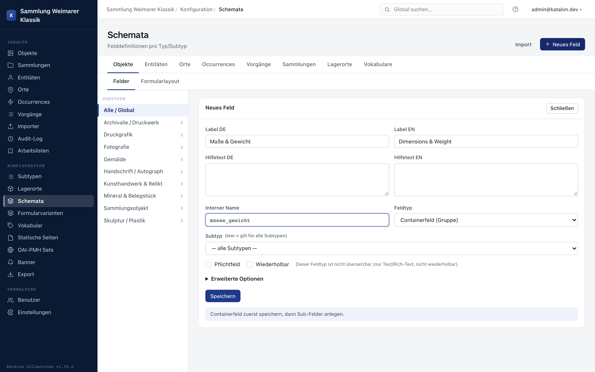

## Overview

The schema determines which fields a record of a given primary type has. Management happens in the admin UI under **Configuration → Schemas**. Fields can be created, edited, and deleted without database migrations.

For a complete example configuration with relation fields and a following procedure, see [Walkthrough: setting up your own collection](/katalon-docs/en/getting-started/eigene-sammlung). More reusable configurations are available in the [Cookbook](/katalon-docs/en/administration/cookbook).

Only users with the `admin` or `superuser` role can create, change, or delete fields.

---

## Creating fields (admin UI)

1. Open the admin UI, select **Schemas** in the left menu.
2. Select the primary type on the left (Objects, Entities, Places, Occurrences).
3. Click **New field** at the top right.
4. Fill in the field properties in the form and save.

After saving, the field is immediately visible in all data-entry forms. Existing records without the new field value remain valid, as long as the field is not marked as required.

### Deleting fields and legacy data (legacy fields)

Deleting a field is a soft delete: the field is marked as `is_deleted` and removed from the schema configuration and from new input forms. Field values already stored in existing records remain untouched in the database.

:::note[Available from version 1.34.0]
When an existing record is opened that still contains values for a field that has since been removed, the data-entry form shows these values in a separate area as **"Not in schema"** (legacy fields):

- The stored values remain fully readable and are not lost when the record is saved.
- Cataloging staff can specifically clean up no-longer-needed legacy data via **"Remove value"**.
- The presence of such legacy data does not block saving the rest of the record.
:::

Directly below the label, a multilingual **help text** can be set. It appears in the data-entry form as a small info icon (?) next to the field label and shows entry guidance, conventions, or examples for this field when clicked — useful for things like date formats, controlled-vocabulary conventions, or internal abbreviations that aren't obvious from the field label alone.

:::note[Available from version 1.30.0]
:::

---

## Properties of a field definition

In the field form, the basic options **Required**, **Repeatable**, and — where applicable — **Multilingual** remain directly visible. Field-type-specific settings such as vocabulary, relation, or authority source also appear directly on the field. Sort order, portal and search display, public API output, facets, validation, default value, locking, and AI configuration are under **Advanced options**.

| Property | Required | Description |
|---|---|---|
| `name` | Yes | Internal identifier (lowercase, underscores). Immutable after creation. Example: `photographer` |
| `label.de` | Recommended | German display label. Appears in the UI. |
| `label.en` | Optional | English display label. |
| `help_text.de` / `help_text.en` | Optional | Help text shown to cataloging staff in the data-entry form next to the field label as an info icon (e.g. entry guidance or conventions for the field). |
| `field_type` | Yes | Field type (see below). |
| `is_required` | No | If set, the field must be filled in when saving a record. |
| `is_repeatable` | No | If set, multiple values can be stored per record. |
| `sort_order` | No | Numeric sort order in the form. Smaller numbers appear first. |
| `target_subtype` | No | If set, the field only applies to the specified subtype. |
| `is_public` | No | Active by default. If the **"Output publicly via APIs"** option is disabled, the value remains visible to logged-in staff, but is published neither in the public portal nor via anonymous REST, search, OAI, or IIIF output. |
| `detail_slot` | No | Assigns the field to the main area or the sidebar on public detail pages. Default: sidebar. |
| `detail_role` | No | Can mark the field as a description. Only one description field is allowed per record type and subtype. |
| `settings` | No | Field-type-specific options as a JSON object (see below). |

## Public and internal fields

The visibility of a field in a detail or list view is not access control. For data such as internal notes, contact details, or not-yet-published provenance information, **"Output publicly via APIs"** must additionally be disabled.

The stored value is then not deleted and remains available in the admin UI and in authenticated API responses. However, Katalon removes it server-side from all anonymous output channels: public portal, public REST responses, search index and facets, OAI-PMH, and IIIF manifests. This also applies to individual sub-fields of a group.

:::note[Available from version 1.26.0]
(De)activating **"Output publicly via APIs"** changes the content of the search index and automatically triggers a rebuild in the background. For larger holdings (tens of thousands of records), it can take a few minutes until the change is fully effective in the portal. Simply toggling a **facet** on or off (in the admin settings under Facets), by contrast, needs no rebuild and takes effect immediately — see [Portal Search](../../integration/portal-suche).
:::

## Arranging fields on portal detail pages

In the field form, **Detail page area** determines whether a public field appears in the main area or the sidebar. With **Detail page role: Description**, a field is used as the central description text. Only one field per record type and subtype can have this role.

The position of the entire sidebar is not set per field, but globally under **Settings → Portal** to left or right. Fields that are not output publicly do not appear in the portal, regardless of these layout settings.

## System fields: `idno` and `label`

Every record of the seven main types (Objects, Entities, Places, Occurrences, Procedures, Collections, Storage Locations) has, in addition to the freely configurable fields, two fixed system fields: `idno` (ID no.) and `label` (title). In the schema editor they are always shown at the very top of the field list, marked **System**, and cannot be deleted or reordered. In the data-entry form they appear as separate inputs in the **Core data** area, not in the freely sortable metadata section below. For both, only the multilingual display name (Label DE/EN) and the help text remain customizable — field type, required status, repeatability, and the other structural settings are fixed.

**`idno`** is the record's institutional/professional identifier (inventory number, call number, location number, or similar) in addition to the internal record ID, which is not visible to users. It is a required field when saving a public or internal record. To avoid manual entry, set up an automatic numbering scheme for the respective main type under **Settings → ID Schemas** — then `idno` is assigned automatically when the record is created (see e.g. [Storage Locations](/katalon-docs/en/administration/lagerorte) for an example of this configuration).

**`label`** is the record's title or designation and is also required. If an object has no sensible title of its own — for example, an unnamed piece of ephemera or a scientific sample without a title — cataloging staff assign a short substitute title in square brackets themselves, e.g. `[Untitled]` or, more descriptively, `[Basalt sample, find location X]`. This bracket convention follows common cataloging standards (RDA "devised title", ISAD(G) "supplied title") and marks the title as supplied by the cataloger rather than taken from the object itself. Katalon does not assign such a substitute title automatically.

:::note[Available from version 1.34.0]
:::

---

## All field types

### `text` – Single-line free text

For short texts without formatting. Can be validated with a regex.

Examples:
- Title
- Inventory number (as an additional identifier alongside `idno`)
- ISBN, ISSN, DOI
- Manufacturer designation

**Settings:**

| Key | Type | Description |
|---|---|---|
| `validation_regex` | String | Optional regular expression. Input is checked against this expression on save. |

Example:
```json
{"validation_regex": "^97[89]-[0-9]{10}$"}
```

---

### `richtext` – Multi-line formattable text

For longer descriptions with simple formatting (bold, italic, lists). The value is stored as HTML.

Examples:
- Description text
- Provenance information
- Conservation notes

---

### `date` – Date

Accepts year, year-month, and day-level values in ISO format. Uncertain dates, date ranges, and open intervals cannot be expressed via syntax in the date value (no EDTF) — for this there are established patterns (see "Cookbook: Dating type" further below).

Examples of valid values:
- `1923` — year only
- `1923-05` — year and month
- `1923-05-14` — exact date
- `-0043` — year BCE (44 BCE)
- `-0043-03-15` — exact date BCE

**Years BCE**: BCE years are entered with a leading minus sign and a four-digit, zero-padded year (`-0043` for 44 BCE). This follows ISO 8601 year numbering with year 0 (1 BCE = year `0000`, 44 BCE = year `-0043`). The built-in calendar widget does not support BCE years — enter BCE values directly into the text field.

Examples of fields:
- Date created
- Date acquired
- Exhibition date

---

### `number` – Numeric value

For integer or decimal numbers.

Examples:
- Height in millimeters
- Weight in grams
- Edition (count)
- Page count

---

### `boolean` – Yes/No

For binary properties.

Examples:
- Is digitized?
- Is conserved?
- Contains personal data?

---

### `vocab` – Vocabulary field

Allows selecting a term from a controlled vocabulary. The associated vocabulary is referenced in `settings.vocabulary_id`.

**Settings:**

| Key | Type | Description |
|---|---|---|
| `vocabulary_id` | UUID | ID of the vocabulary from vocabulary management. Required for `vocab` fields. |

Example:
```json
{"vocabulary_id": "3fa85f64-5717-4562-b3fc-2c963f66afa6"}
```

The vocabulary's UUID can be found in the admin UI under **Configuration → Vocabularies**.

:::note[Available from version 1.25.2]
Hierarchy browser: For hierarchical vocabularies (broader/narrower), in addition
to text search, the tree can be browsed directly in the field. The tree button
to the right of the input field opens the structure view; the "Search" and
"Structure" tabs switch between the two modes. The arrows in front of a term
expand or collapse the next deeper level; clicking the term itself applies it
to the field. The selected term continues to show its parent path
(broader chain) as a breadcrumb.
:::

Examples of fields:
- Material type (vocabulary: Materials)
- Camera type (vocabulary: Camera types)
- Genre (vocabulary: Genres)


:::tip[Best practice: license and rights fields]
License and rights information (e.g. Creative Commons, RightsStatements.org) should **never be a free-text field** (`text`), but always a controlled vocabulary field (`vocab`) with a stored canonical URI, to meet requirements for machine-readable metadata (e.g. ECHOES D6.2, Europeana, DDB).
👉 See the recipe in [Cookbook: Machine-readable licenses and rights statements](/katalon-docs/en/administration/cookbook#machine-readable-licenses-and-rights-statements-echoes--fair).
:::
---

### `vocab_free` – Vocabulary field with free text

Text input with an optional vocabulary as an autocomplete source. Unlike `vocab`, the entered value is not bound to a term in the vocabulary — the user can enter any text or choose a suggestion from the autocomplete list.

**UX difference from `vocab`:**

| | `vocab` | `vocab_free` |
|---|---|---|
| Input | Strict picker, only vocabulary terms selectable | Free-text field with optional suggestions |
| Stored format | `{"id": "uuid", "label": "Term"}` | `"Term"` (plain string) |
| Referential integrity | Term ID stays linked | No referential link |

**Settings:**

| Key | Type | Description |
|---|---|---|
| `vocabulary_id` | UUID | Optional. Vocabulary whose terms are shown as autocomplete suggestions. Without it: plain free-text field without suggestions. |

:::note[Available from version 1.25.2]
If a hierarchical vocabulary is set, the hierarchy browser is also available
here (tree button to the right of the input field): terms can be clicked
through the structure instead of being searched for; free entry remains
possible as well.
:::

Example:
```json
{"vocabulary_id": "3fa85f64-5717-4562-b3fc-2c963f66afa6"}
```

Examples of fields:
- Technique / production method (many free-text variants, vocabulary as help)
- Keyword (free entry, but control over known terms)

---

### `relation` – Link to another record

Links the record to another record (Object, Entity, Place, or Occurrence). The relation is stored in the `relations` table.

Examples:
- Photographer → Entity (person)
- Place of capture → Place
- Based on → Object (another object)
- Copy of → Occurrence (a bibliographic work)

Relation fields are intended for domain-named relationships in the
data-entry form, such as "Author" or "Place of capture". They can set a
target type, a relation-type vocabulary, and optionally a fixed relation
type. Without a fixed type, the cataloger can choose a suitable type from the
vocabulary. With a fixed type, exactly that semantics is used.

The relationships card of a saved record is not a second editing surface
for such fields: it shows the complete relationship graph and only adds
further, free relationships to other main types. This way, a domain-configured
relationship remains editable in its associated form field, while additional
graph relationships remain possible as well.

For portal search, a relation field can pull selected fields of its target
type into the search index. A fixed relation type restricts these values to
the corresponding relationship; without a fixed type, values from all
relationships to the chosen target type are pulled in.

---

### `geo` – Geographic coordinates

Stores a geographic point (longitude and latitude). For place types, the location is additionally stored as PostGIS geometry.

Examples:
- Exact place of capture of a photograph
- Find location of an object

---

### `url` – Web link

Stores an external link with an optional link title. The URL is validated on
save and displayed as clickable in the admin UI and portal.

Examples:
- Digitized copy in an external repository
- Project or exhibition page
- Already-assigned external identifier with a target page

A value consists of a URL and an optional title:

```json
{"value": "https://example.org/digitalisat/42", "label": "Digitized copy"}
```

---

### `pid` – Persistent identifier

For a persistent identifier assigned by Katalon. PID fields are read-only in
the data-entry form: staff select **Reserve** to assign an identifier;
afterwards it is displayed as a resolver link.
When publishing, Katalon automatically reserves missing, configured PIDs.
If assignment fails, publishing is aborted.

**Settings:**

| Key | Type | Description |
|---|---|---|
| `pid_provider` | String | `ark` or `dnb_urn`. Sets the assignment service. Only fully configured services can be selected. |

Example:
```json
{"pid_provider": "ark"}
```

Examples:
- ARK for a public record
- DNB URN for a published record

If no service is operational, the `pid` field type is not available for new
fields. Already-assigned PIDs remain visible even if their service is
later disabled.


### `authority` – Authority-data field

For normalized entities and identifiers from connected external sources (GND, Wikidata, GeoNames, VIAF, Getty AAT, Getty TGN, ICONCLASS).

In the data-entry form, the field offers an interactive autocomplete search against the external API in real time. On selection, identifier, label, description, and, where applicable, geo-coordinates (GeoNames) are stored and displayed as a clickable link to the original source.

**Settings:**

| Key | Type | Description |
|---|---|---|
| `source` | String | ID of the connected authority source, e.g. `gnd`, `wikidata`, `geonames`, `viaf`, `aat`, `tgn`, or `iconclass`. Only sources enabled under **Settings → Authority Sources** can be selected. |

Example:
```json
{"source": "gnd"}
```

Examples:
- GND record for a person or corporate body
- GeoNames place with coordinates and automatic map preview
- Wikidata reference for iconographic or subject classifications

The `authority` field can be used both as a standalone schema field and as a sub-field within a field group (`group`). For full details see [Authority Data & Linked Data](/katalon-docs/en/administration/normdaten/).

---

### `group` – Field group

Combines several sub-fields into a repeatable unit (e.g. for structured information consisting of several values). Sub-fields are created directly below the group after it is created; allowed types are `text`, `date`, `number`, `boolean`, `vocab`, `vocab_free`, `relation`, `authority`.



Examples:
- Dimension (value + unit)
- Exhibition participation (exhibition + role)

---

## Cookbook: Dating type (uncertain/qualified dating)

The `date` field only accepts concrete dates (see above). Approximate values and date ranges are not expressed via syntax in the date value (no EDTF) — for this there are two established patterns:

- **Date range (from/to)**: two separate `date` fields, e.g. `date_created_from` / `date_created_to`.
- **Qualification (circa/before/after/exact)**: a combination of `group` + `date` + `vocab`:

1. Create a vocabulary, e.g. `dating_type` with terms: `exact`, `circa`, `before`, `after`, `undated`.
2. Create a field of type `group`, e.g. `dating` (label "Dating").
3. Create two sub-fields under it:
   - `date` (type `date`)
   - `type` (type `vocab`, `settings.vocabulary_id` → vocabulary `dating_type`)

Result: multiple datings, each with its own type, can be captured per record (e.g. creation "circa 1920", acquisition "exact 1955"), and the type is facetable/searchable as a vocabulary value — independent of the date value. Qualifying a BCE date also works this way: `date = -0043`, `type = circa` ("circa 44 BCE").

---

## Subtype fields

For Object, Entity, Place, Occurrence, and Procedure, a field can be bound to a specific subtype.

- **Field without `target_subtype`**: Appears for all records of this primary type, regardless of subtype.
- **Field with `target_subtype = "person"`**: Appears only for entities of subtype `person`.
- **Field with `target_subtype = "acquisition"`**: Appears only for procedures of type `acquisition`.

**Use case:**

An entity can be a person or an organization. Persons need a date of birth and place of death, organizations need a founding year and legal form. Subtype fields let you control the form accordingly.

In the admin UI, an existing subtype can be selected for each record type. If the subtype input field is left empty, the field applies to all subtypes.

Subtypes are created in subtype management and validated server-side. For procedures, `loan_out`, `loan_in`, `acquisition`, `conservation`, `object_entry`, and `deaccession` are created as the initial set. Like custom procedure types, they can be deleted as long as no procedure uses them; deleting one deactivates its subtype-specific field definitions and form variants. Custom procedure types can additionally be created and used for fields and form variants.

---

## Schema import from YAML or JSON

Instead of creating fields one by one, field definitions can be imported as a YAML or JSON file. This is useful for initial schema configuration or when transferring a schema between instances.

The import happens in the admin UI under **Configuration → Schemas → Import**.

### File format

The file describes a primary type and a list of fields:

```yaml
target_type: object
fields:
  - name: title
    label:
      de: Titel
      en: Title
    field_type: text
    is_required: true
    is_repeatable: false
    sort_order: 0

  - name: date_created
    label:
      de: Entstehungsdatum
      en: Date created
    field_type: date
    is_required: false
    is_repeatable: false
    sort_order: 10

  - name: material
    label:
      de: Material
    field_type: vocab
    is_required: false
    is_repeatable: true
    sort_order: 20
    settings:
      vocabulary_id: "3fa85f64-5717-4562-b3fc-2c963f66afa6"

  - name: description
    label:
      de: Beschreibung
    field_type: richtext
    is_required: false
    is_repeatable: false
    sort_order: 30

  - name: photographer
    label:
      de: Fotograf:in
      en: Photographer
    field_type: relation
    is_required: false
    is_repeatable: true
    sort_order: 40
```

Equivalent JSON format:

```json
{
  "target_type": "object",
  "fields": [
    {
      "name": "title",
      "label": {"de": "Titel", "en": "Title"},
      "field_type": "text",
      "is_required": true,
      "is_repeatable": false,
      "sort_order": 0
    }
  ]
}
```

### Field specification (complete)

| Key | Type | Required | Default | Description |
|---|---|---|---|---|
| `name` | String | Yes | — | Internal name. Must be unique within the type. |
| `label` | Object | No | `{}` | Labels per language: `{"de": "...", "en": "..."}` |
| `field_type` | String | No | `text` | One of the valid field types (see above) |
| `is_required` | Boolean | No | `false` | Required field |
| `is_repeatable` | Boolean | No | `false` | Repeatable |
| `sort_order` | Integer | No | Index in list | Order in the form |
| `target_subtype` | String | No | `null` | Only valid for this subtype |
| `settings` | Object | No | `{}` | Field-type-specific options |

### Dry run

If the **Dry run** option is enabled, the file is parsed and evaluated, but nothing is written to the database. The result shows:
- How many fields would be newly created
- How many fields would be updated (only with the overwrite option)
- How many fields would be skipped (already present, no overwrite)
- Errors in the file (missing required fields, invalid structure)

### Overwrite

By default, fields that already exist under the same `name` are skipped. With the **Overwrite existing** option, existing fields are updated with the values from the import file.

A field's `name` cannot be changed after creation — it serves as the identification key on import.

---

## Validation regex for text fields

For fields of type `text`, a regular expression can be set as a validation rule. On data entry, the entered value is checked against this expression.

The expression is stored in `settings.validation_regex`:

```json
{"validation_regex": "^\\d{4}$"}
```

**Useful examples:**

| Use case | Expression |
|---|---|
| Four-digit year | `^\d{4}$` |
| ISBN-13 | `^97[89]-[0-9]{10}$` |
| ISSN | `^\d{4}-\d{3}[\dX]$` |
| DOI | `^10\.\d{4,}/.+$` |
| GND ID (numeric) | `^\d{8,10}[\dX]$` |

In the admin UI, there is an input field for the regex directly in the field form (only visible when `field_type = text`).

---

## Type validation and data integrity

:::note[Available from version 1.34.0]
When saving a record, Katalon strictly validates all metadata server-side against the field types declared in the schema:

- **Numbers (`number`):** Only genuine numbers (integers or floating-point numbers, or `null`) are accepted; strings are rejected.
- **Booleans (`boolean`):** Require genuine booleans (`true`/`false` or `null`).
- **Dates (`date`):** Checked against standard-compliant date formats.
- **Geo-coordinates (`geo`):** Validated against valid coordinate values or GeoJSON structures.
- **Vocabularies (`vocab`, `vocab_free`):** Referenced term IDs are checked for existence in the database. Historical values from terms deleted later are tolerated when updating existing records.
- **Groups (`group`):** All sub-fields of a group are type-checked recursively.
:::

---


## Configuring vocabulary fields

To link a `vocab` field to a vocabulary:

1. Make sure the desired vocabulary exists under **Configuration → Vocabularies**.
2. Copy the vocabulary's UUID (visible in the detail view).
3. Create or edit the field, choose field type `Vocabulary`.
4. Enter the UUID in the `settings.vocabulary_id` field.

When creating via schema import: insert the UUID in `settings.vocabulary_id` (see example above).

Without `vocabulary_id`, the field shows an empty selection list during data entry.
