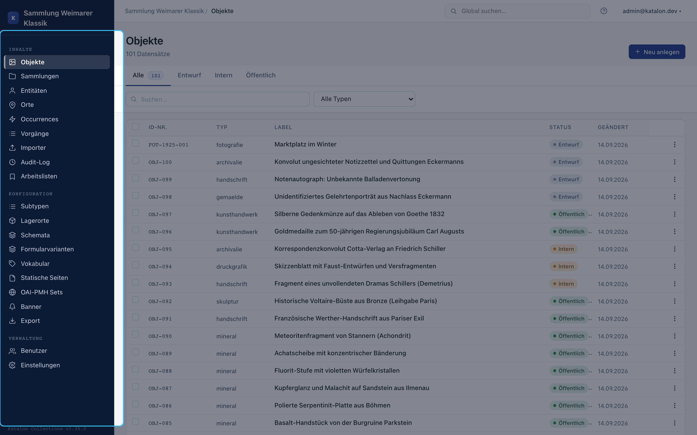
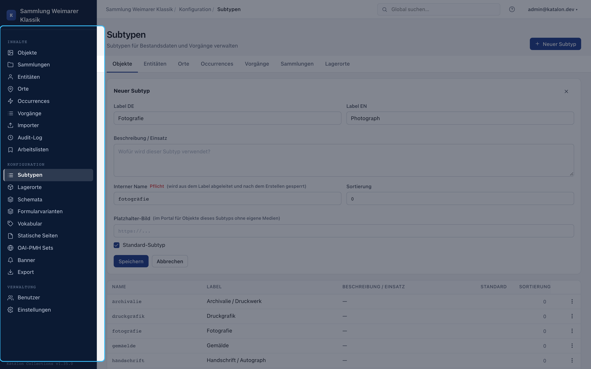
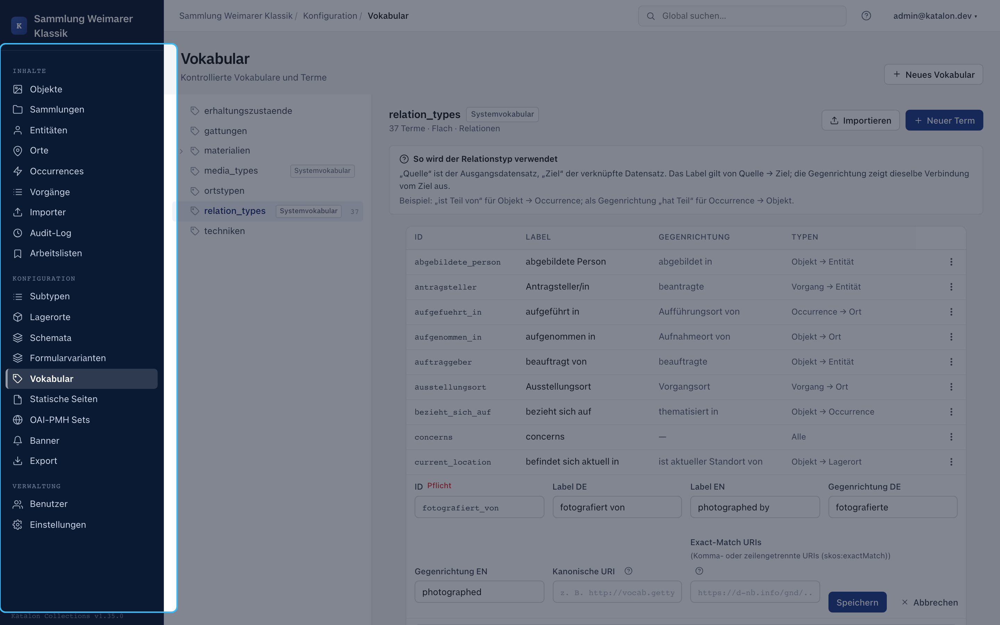
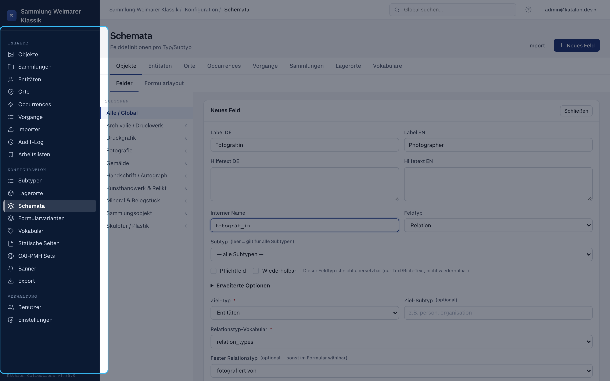
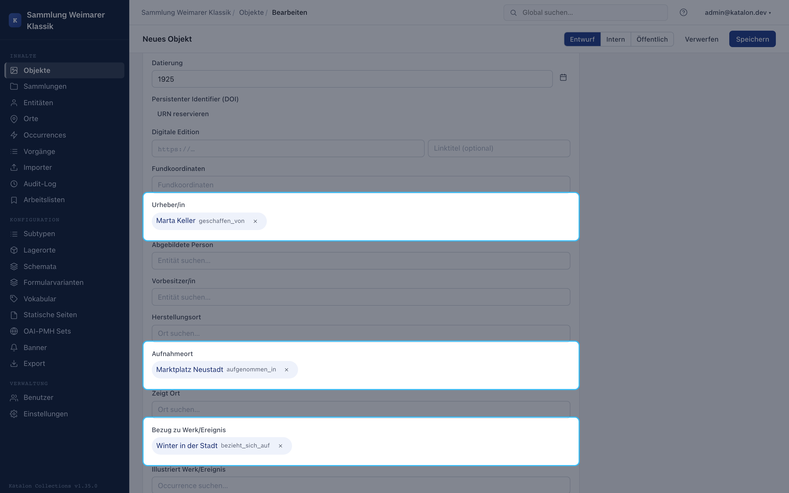
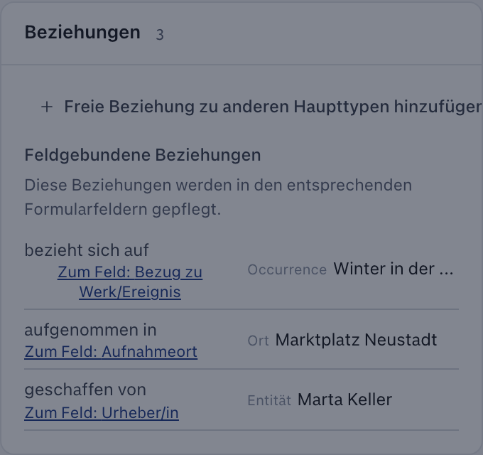
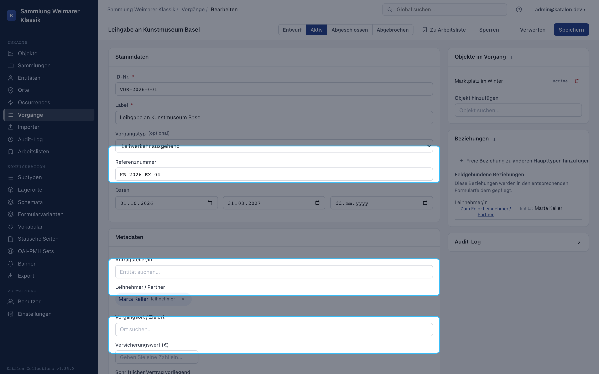

This walkthrough sets up a small photographic collection. The example separates the photograph itself, the photographing person, the place where it was taken, and an exhibition. This keeps the information searchable later and lets it be reused without duplicate entries.

An `admin` or `superuser` role is required for configuration. The onboarding tour on first login walks through the same areas; this text is intentionally more detailed and can be used independently of the tour.

## The Example Model

| Katalon Type | Example | Role in the Model |
|---|---|---|
| Object | Photograph "Marketplace in Winter" | The artefact being held or described. |
| Entity | Marta Keller | A person or organization, here the photographer. |
| Place | Neustadt Market Square | The geographic place where it was taken. |
| Occurrence | Exhibition "Winter in the City" | A work, event, or concept with no physical carrier. |

An object does not receive free-text copies of a name or place. It is linked to the corresponding records instead. If the place name is corrected, for example, the correction appears everywhere it is linked.

## Creating Subtypes

Subtypes are optional. They pay off when a primary type needs different forms. For this example, the four subtypes `fotografie`, `person`, `stadt`, and `ausstellung` are enough.

1. Under **Configuration → Subtypes**, select the relevant primary type.
2. Choose **New Subtype** and enter German and English labels.
3. Check the suggested internal name, e.g. `fotografie`. Once saved, this name becomes the stable key and can no longer be changed.
4. For a frequently used type, enable **Default Subtype**.

Fields without a subtype apply to all records of a primary type. A field bound to `fotografie` appears only there. The full explanation is under [Subtypes](/katalon-docs/en/administration/subtypen).

## Defining Relation Types Before Relation Fields

Relations need a domain-specific meaning. Under **Configuration → Vocabularies**, create a relation vocabulary and enter at least these terms:

| Direction from the Object | Reverse Direction | Allowed Combination |
|---|---|---|
| photographed by | has photographed | Object → Entity |
| taken at | is place of capture of | Object → Place |
| shown in | shows | Object → Occurrence |

The first phrase applies from the source record to the target. The reverse direction appears when the same connection is read from the target's side. The restriction to type combinations prevents, for example, a photograph from being linked to a place with "photographed by".

## Configuring Data-Entry Fields

Fields are created under **Configuration → Schemas**. A few fields are enough to start:

| Type | Field | Field Type | Setting |
|---|---|---|---|
| Object | Title | Text | Required |
| Object | Date of Creation | Date | optional |
| Object | Photographer | Relation | Target type Entity, relation type "photographed by", repeatable if multiple people are possible |
| Object | Place of Capture | Relation | Target type Place, relation type "taken at" |
| Object | Shown In | Relation | Target type Occurrence, relation type "shown in", repeatable |
| Entity | Name | Text | Required |
| Place | Name | Text | Required |
| Occurrence | Title | Text | Required |

For the relation field, select the previously created relation vocabulary and set the fixed relation type. A fixed type preserves the field's meaning: "Photographer" always stores "photographed by".

Details on field types, multilingual support, and search options are in [Schema Management](/katalon-docs/en/administration/schema). Relation fields are also described there for the search index.

## Entering the First Four Records

First create the context records: Entity, Place, and Occurrence. Then, under **Objects**, open the photograph and fill in title and date. In the relation fields, search for "Marta Keller", "Neustadt Market Square", and "Winter in the City", select the matching hit for each, and save.

The results list appears only after at least two characters have been entered. If a target does not yet exist, quick-create can create the matching record directly from the relation field. It adopts a fixed target subtype if the field has one configured.

## Domain-Defined and Free Relationships

The relation fields in the form are the right place for recurring domain statements like "Photographer" or "Place of Capture". The **Relationships** card of a saved record shows the same graph but only adds additional free relationships. There, for example, a photograph can be linked to a procedure or a related object without extending the schema with a permanent field.

Don't enter the same connection in both places. A duplicate relation creates no additional information.

## Adding a Procedure

Procedures document institutional work on the holdings, such as loans, acquisitions, or conservation. They are not public events. For this example, an outgoing loan is created.

1. Under **Procedures**, create a new record and select the type **Outgoing Loan** (`loan_out`).
2. Enter ID number, reference number, start date, and return date. Additional fields, such as insurance value or contact person, are configured for the procedure type in the schema like for other records.
3. Save the procedure first. Then link the object and the receiving institution in the Relationships card.
4. Set the status to **Active** while the loan is ongoing. Deliberately set the object's collection status to **On Loan** if needed.
5. After the object returns, choose **Complete**. Katalon suggests the object status **Active** for `loan_out`. The suggestion can be confirmed or the procedure can be completed without a status change.

An object cannot be part of two simultaneously active procedures of type `loan_out`. Other procedure types and custom-created types have no built-in domain rules. Completion never changes the object status without asking.

Further cases are in the [Cookbook](/katalon-docs/en/administration/cookbook). The [Procedures Concept Paper](/katalon-docs/en/reference/procedures) explains the complete procedures framework and its limits.
