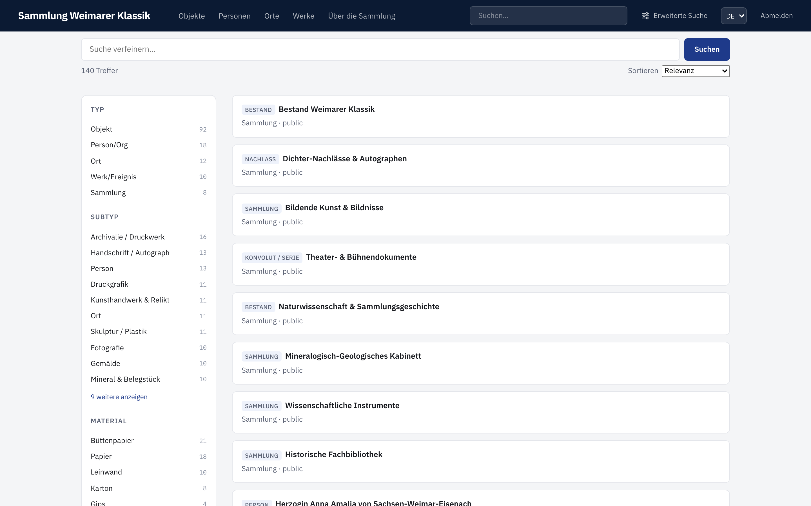
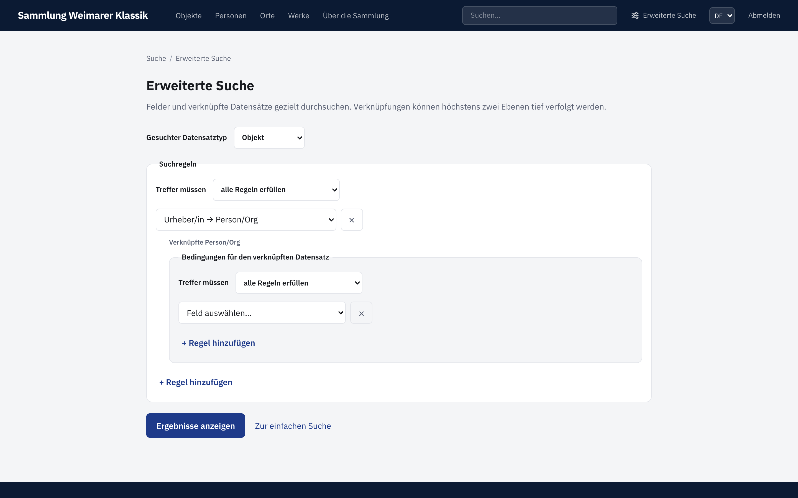
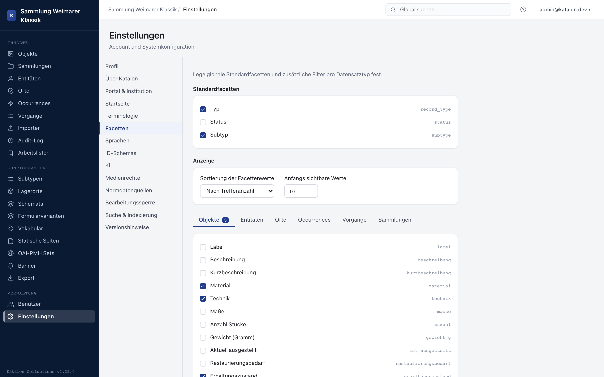

The quick search at the top of the portal searches Objects, Entities, Places, and Occurrences together. On the results page, hits can be narrowed down further using the available facets. Every result card shows a small marker next to the title with the record's subtype (e.g. "Painting", "Person"); if the record has no subtype, the general record type is shown instead.

:::note[Available from version 1.36.0]
Consistent subtype marker on result cards.
:::

Number fields set up as a facet are filtered as a range. Enter an exact value in **From** and **To**, or move the two sliders. One of the two bounds can be left empty; **All** removes the number range again.

Under **Advanced Search**, you first choose the desired result type. Public search fields can then be combined with **all** or **at least one**. For relation fields, conditions for linked records can be added. Up to two linking steps are possible, for example:

> Objects whose photographer was born before 1950 and whose place of birth is Bremen.

For fixed vocabulary fields, the permitted terms are offered as a selection. Free vocabulary fields suggest configured terms but still allow a custom value.

The results list uses the same page as the quick search. The search definition is preserved in the URL and can therefore be bookmarked or shared. For very broad relation conditions, the portal prompts you to narrow the search further.

## Setting up facets

Which facets are offered in the portal is set per record type in the admin settings under **Facets**. This requires that the field is output publicly and appears in the detail view.

:::note[Available from version 1.26.0]
Turning a facet on or off takes effect **immediately** — no rebuild of the search index is needed for that. Only when you change a field's visibility itself (**"Output publicly via APIs"** or detail view) does Katalon rebuild the search index in the background; for very large holdings this can take a few minutes (see [Managing Schemas](/katalon-docs/en/administration/schema/)).
:::
