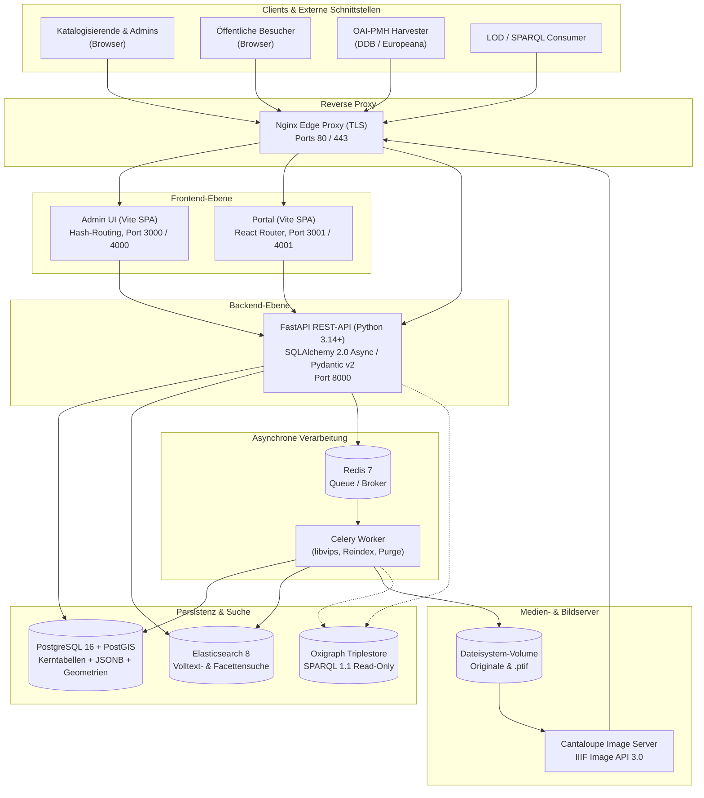

Katalon Collections ist ein Open-Source Metadata Management System (MMS) für den GLAM-Sektor (Galleries, Libraries, Archives, Museums). Die Architektur folgt einem konsequenten **API-First-Muster**: Ein asynchrones Python/FastAPI-Backend stellt eine standardisierte REST-API bereit, während zwei eigenständige React-Frontends (Admin-Oberfläche und öffentliches Portal) diese konsumieren.

:::note[Verfügbar ab Version 1.36.0]
Die beschriebene Architektur umfasst die 7 Kern-Datensatztypen, die dynamische Schema-Engine, die IIIF 3.0 Bildverarbeitung sowie die Linked-Data- und SPARQL-Projektion.
:::

## Architekturübersicht

Katalon folgt dem Paradigma **„Relationales MMS mit Projektionen“**. Das bedeutet: Die transaktionale Wahrheit aller Metadaten und Relationen liegt in PostgreSQL. Spezifische Abfrageanforderungen werden über spezialisierte Projektionen bedient (Elasticsearch für facettierte Schnellsuche, Oxigraph für semantische SPARQL-Queries, Cantaloupe für IIIF-Kacheln).



---

## Service-Übersicht

In einer typischen Docker-Compose-Umgebung setzt sich Katalon Collections aus folgenden Diensten zusammen:

| Service | Basis-Image | Zweck & Aufgabe | Persistenz |
|---|---|---|---|
| `api` | `python:3.14-slim` | FastAPI REST-API, Geschäftslogik, Schema-Engine, Auth, OAI-PMH, Export-Endpunkte | Keine (stateless) |
| `worker` | `python:3.14-slim` | Celery-Hintergrundarbeiter für Pyramiden-TIFF-Generierung via libvips, Massen-Reindex und periodische Jobs | Keine (stateless) |
| `db` | `postgis/postgis:16-3.4-alpine` | Transaktionaler Primärspeicher: Relationale Kerntabellen, JSONB-Metadaten und PostGIS-Geometrien | Volume `db_data` |
| `redis` | `redis:7-alpine` | Message-Broker und Ergebnis-Speicher für Celery-Tasks | In-Memory / transiente Queue |
| `elasticsearch` | `elasticsearch:8.13.0` | Suchmaschine für blitzschnelle Volltextsuche, facettierte Filter und Autovervollständigung | Volume `es_data` |
| `cantaloupe` | `islandora/cantaloupe:latest` | IIIF Image API 3.0 konformer Bildserver für Deep Zoom und dynamischen Bildabruf | Volume `media_data` (Read) |
| `admin` | Node Build → `nginx:alpine` | Administrations- und Erfassungsoberfläche (React SPA mit Hash-Routing) | Keine (statisch) |
| `portal` | Node Build → `nginx:alpine` | Öffentliches Rechercheportal (React SPA mit URL-Routing und Theme-Engine) | Keine (statisch) |
| `nginx` | `nginx:alpine` | Zentraler Reverse Proxy, SSL/TLS-Terminierung und Routing (im Produktivbetrieb) | Zertifikate & Logs |
| `oxigraph` *(optional)* | `oxigraph/oxigraph` | SPARQL 1.1 Triplestore für materialisierte Linked Open Data RDF-Graphen | Volume `oxigraph_data` |

---

## Kernkomponenten im Detail

### 1. Frontends: Admin vs. Portal

Katalon trennt strikt zwischen der internen Arbeitsumgebung und dem öffentlichen Präsentations- und Recherchebereich:

- **Admin-Oberfläche (`frontend/admin`)**:
  - **Technologie:** React, TypeScript, Vite.
  - **Routing:** Bewusst **hash-basiert** (`#objects`, `#schema`, `#vocab`, `#form-variants/objects.person`). Dies ermöglicht Deep-Linking und Browser-Historie ohne komplexe Server-Rewrite-Regeln und vereinfacht die Bereitstellung unter Subpfaden (wie `/admin/`).
  - **Onboarding:** Neue Administrator:innen werden beim ersten Login durch eine geführte Onboarding-Tour (*react-joyride*) begleitet. Ein persistenter Hilfe-Button in der Topbar verlinkt direkt auf die jeweils relevante Seite dieser Dokumentation.
  - **Sicherheit:** Erfordert Authentifizierung via JWT (Bearer Token). Rollen- und berechtigungsgesteuerte Oberflächenelemente.
  - **Aufgabe:** Dynamische Datenerfassung, Schema-Editor, Vokabularverwaltung, Rollen- und Rechtematrix, Stapelverarbeitung und Datenimport.

- **Öffentliches Portal (`frontend/portal`)**:
  - **Technologie:** React, TypeScript, Vite.
  - **Routing:** **URL-basiert** mit *React Router v6* (`/objects/:id`, `/search`, etc.) für suchmaschinenfreundliche URLs (SEO).
  - **Sicherheit:** Rein öffentlich, keine Authentifizierung erforderlich. Das Portal greift ausschließlich auf Endpunkte zu, die Datensätze mit `status = "public"` ausliefern.
  - **Deep Zoom:** Integrierter OpenSeadragon-Viewer, der hochauflösende Bilddigitalisate nahtlos über die IIIF Image API 3.0 nachlädt.
  - **Drop-in Themes:** Vollständig anpassbar über das Zwei-Ebenen-Theming (CSS-Custom-Properties über die Admin-UI sowie dateibasierte Theme-Pakete).

### 2. FastAPI Backend (Python 3.14+)

Das Backend ist das Herzstück des Systems:

- **Asynchrones Design:** Konsequente Nutzung von `async` und `await` für Datenbankabfragen, HTTP-Aufrufe und externe Schnittstellen zur Maximierung des Durchsatzes bei geringem Speicherbedarf.
- **SQLAlchemy 2.0 Async:** Moderne, typsichere ORM-Schicht mit `asyncpg`-Treiber für asynchrone PostgreSQL-Transaktionen.
- **Pydantic v2:** Strikte Validierung aller eingehenden API-Payloads und automatische Generierung von OpenAPI-3.1-Spezifikationen.
- **Schichtenarchitektur:**
  - `api/v1/`: Dünne Endpunkt-Handler (Routing, Request-Validierung, Authentifizierung/Autorisierung).
  - `services/`: Wiederverwendbare Geschäftslogik (Export-Mappings, Reindexierung, Vokabular-Auflösung, Audit-Logging).
  - `integrations/`: Adapter für Drittsysteme (Elasticsearch, Cantaloupe, Normdaten-Quellen wie GND, GeoNames, Wikidata).
  - `workers/`: Celery-Tasks für zeitintensive Hintergrundarbeiten.

### 3. PostgreSQL 16 + PostGIS + JSONB

Der primäre Datenspeicher kombiniert relationale Strenge mit dokumentenorientierter Flexibilität:

- **Sieben Kerntypen:**
  1. `objects` – Physische und digitale Artefakte (Gemälde, Fotos, Skulpturen, Schriftgut).
  2. `entities` – Akteure (Personen, Körperschaften, Familien).
  3. `places` – Geografische Orte (mit nativer PostGIS-Punktgeometrie `geometry(Point, 4326)` für präzise Raumkoordinaten).
  4. `occurrences` – Werke (FRBR/LRM), historische Ereignisse, Ausstellungen, Konzepte.
  5. `collections` – Sammlungsstrukturen und Archivtektonik (hierarchisch via `parent_id`).
  6. `storage_locations` – Interne Lagerorte (Gebäude → Raum → Regal → Fach, rein intern/nicht-öffentlich).
  7. `procedures` – Vorgänge wie Leihverkehr, Restaurierung oder Erwerbung.
- **Hybrides Speichermodell:**
  - Feste relationale Spalten für betriebs- und sicherheitskritische Werte: `id` (UUID), `idno` (Inventarnummer/Signatur), `status` (`draft`, `internal`, `review`, `public`), Zeitstempel und `version` (optimistische Sperre gegen Überschreibkonflikte).
  - Flexibles JSONB-Feld `metadata_`: Nimmt alle dynamisch im Schema definierten Attribute auf (Texte, strukturierte Datumsangaben, Vokabularbegriffe, Maßangaben).
- **Generische Relationen:**
  Die Tabelle `relations` verknüpft beliebige Datensätze typübergreifend (`from_type`, `from_id`, `to_type`, `to_id`, `relation_type`). Relationen können zusätzliche Metadaten tragen (z. B. Datierung oder spezifische Rollen).

### 4. Elasticsearch 8 (Suchmaschine)

Während PostgreSQL die Transaktionssicherheit garantiert, übernimmt Elasticsearch 8 die performante Such- und Filterarbeit:

- **Denormalisierter Index (`katalon_records`):** Datensätze werden für den Suchindex flach aufbereitet. Verknüpfte Entitäten (z. B. Künstlername), Orte und Schlagwörter werden direkt in das Suchdokument eingebettet.
- **Mehrsprachige Volltextsuche:** Angepasste Analyzer mit N-Gramm-Zerlegung und Stemming ermöglichen unscharfe Suchen und Wortstammzerlegungen für deutsche und englische Bezeichnungen.
- **Facettierung & Aggregationen:** Aggregationen über Objekttypen, Datierungszeiträume, Sammlungszugehörigkeiten und Schlagworte liefern die Zähler für die Filterleiste im Portal in Echtzeit.

### 5. Redis & Celery (Asynchrone Tasks)

Laufzeitintensive Aufgaben werden niemals synchron im HTTP-Request blockiert, sondern in eine Celery-Queue eingereiht:

- **Pyramiden-TIFF-Generierung:** Hochgeladene Bildoriginale werden im Hintergrund über die performante C-Bibliothek `libvips` (`pyvips`) verlustfrei in multiresolution Pyramiden-TIFFs (`.ptif`) transformiert.
- **Massen-Reindexierung:** Bei Änderungen an Schemafeldern oder Vokabularen werden die betroffenen Datensätze im Hintergrund asynchron in Elasticsearch aktualisiert.
- **Celery Beat & Housekeeping:** Periodische Cron-Jobs führen Aufräumarbeiten durch (z. B. Bereinigung temporärer Uploads und Abarbeitung von Soft-Delete-Warteschlangen).

### 6. Cantaloupe & IIIF Image API 3.0

- **Cantaloupe:** Ein in Java geschriebener Open-Source-Bildserver, der speziell für GLAM-Anwendungen optimiert ist.
- **Dynamische Kachelung:** Liest die vom Celery-Worker erzeugten `.ptif`-Dateien direkt aus dem gemeinsamen Medienvolume. Bei Zoom-Anfragen im Portal liefert Cantaloupe präzise Bildausschnitte (Tiles) on-the-fly im angeforderten Format (WebP/JPEG) aus.
- **Standard-Konformität:** Vollständige Unterstützung der IIIF Image API 3.0 sowie Bereitstellung strukturierter IIIF Presentation Manifeste für komplexe Multipage-Objekte.

### 7. Medienablage & Soft-Delete

- **Dateistruktur:**
  - `master/`: Unveränderte Originaldateien mit kryptografischen Prüfsummen (SHA-256) für die Integrität.
  - `derivatives/`: Vom Worker erzeugte Pyramiden-TIFFs (`.ptif`) für die IIIF-Auslieferung.
- **Soft-Delete:** Medien und Datensätze werden beim Löschen in der Benutzeroberfläche zunächst als gelöscht markiert (`deleted_at`). Physische Dateien auf dem Storage verbleiben geschützt, bis ein konfigurierbarer Bereinigungszyklus sie endgültig entfernt.

---

## Datenflüsse

### Schreibpfad (Erfassung & Speicherung)

```
[Admin-Formular]
       │  1. Absenden der Formulardaten (JSON)
       ▼
[FastAPI Route Handler]
       │  2. Validierung gegen Pydantic-Schema & field_definitions
       │  3. Prüfung von Rechten & Capabilities (RBAC)
       ▼
[PostgreSQL Transaktion]
       │  4. Update relationaler Felder & JSONB (metadata_)
       │  5. Prüfung der Versionsnummer (Optimistic Locking)
       │  6. Eintrag im audit_log (Historisierung)
       ▼
[Celery Background Task]
       │  7. Event wird via Redis an Celery-Worker übergeben
       ├───────────────────────────────┐
       ▼                               ▼
[Elasticsearch Indexer]     [libvips Bildprozessor]
 Aktualisierung des          Konvertierung von Uploads
 Suchdokuments in ES         in Pyramiden-TIFF (.ptif)
```

### Lesepfad (Recherche im Portal)

```
[Portal-Nutzer]
       │  1. Suchbegriff oder Facettenfilter eingeben
       ▼
[FastAPI Portal API]
       │  2. Validierung der Parameter & Rate-Limiting
       ▼
[Elasticsearch 8]
       │  3. Ausführung der Volltextsuche & Aggregationen (Facetten)
       ▼
[Portal Frontend]
       │  4. Schnelle Anzeige der Trefferliste & Filterzähler
       ▼
[Deep Zoom Bildbetrachtung]
       │  5. Bildabruf über OpenSeadragon
       ▼
[Cantaloupe IIIF Server]
       │  6. Dynamisches Kacheln aus .ptif auf dem Dateisystem
       ▼
[Browser]
```

---

## Erweiterungspunkte (Extension Points)

Katalon wurde modular konzipiert, sodass Institutionen das System ohne Forking an eigene Anforderungen anpassen können:

1. **Dynamische Schema-Engine:**
   Neue Metadatenfelder, Feldgruppen, Validierungsregeln und Standardwerte werden direkt über die Benutzeroberfläche konfiguriert — ganz ohne Datenbankmigrationen oder Software-Neustarts.
2. **Normdaten-Adapter (`AuthoritySource`):**
   Über die abstrakte Python-Basisklasse `AuthoritySource` können beliebige externe Normdatenbanken (wie lokale Thesauri, Spezial-SPARQL-Endpunkte oder Archivdatenbanken) angebunden werden. Standardmäßig mitgeliefert werden Adapter für GND (via lobid.org), GeoNames, VIAF, Wikidata, Getty TGN und ICONCLASS.
3. **Export-Plugins (`MetadataFormat`):**
   Neue Ausgabeformate (z. B. museums- oder bibliotheksspezifische XML-Dialekte) implementieren die Schnittstelle `MetadataFormat`. Sie deklarieren ihre Zielpfade, Validatoren und Mappings deklarativ.
4. **Drop-in Themes:**
   Das Erscheinungsbild des Portals kann über ein Theme-Verzeichnis (`themes/<name>/`) mit `theme.json`, `custom.css`, eigenen Webfonts und JavaScript individualisiert werden.
5. **SPARQL & Triplestore-Projektion:**
   Über das optionale Compose-Profil `rdf` wird ein Oxigraph-Triplestore zugeschaltet. Bei der Veröffentlichung von Datensätzen werden semantische RDF-Graphen (nach CIDOC-CRM und LRMoo) automatisch projiziert und über `/sparql` bereitgestellt.

---

## Deployment-Modelle

Katalon unterstützt zwei standardisierte Betriebsmodi via Docker Compose:

### 1. Entwicklungsbetrieb (`make dev`)

Verwendet `docker-compose.yml` kombiniert mit `docker-compose.dev.yml`:
- **Live-Reload überall:** Quellcode-Verzeichnisse (`backend/src`, `frontend/admin/src`, `frontend/portal/src`) sind als Bind-Mounts in die Container eingehängt.
- **Uvicorn Reload:** Backend-Änderungen an `.py`-Dateien starten die API sofort neu.
- **Vite HMR:** Frontend-Änderungen spiegeln sich ohne Neuladen per Hot Module Replacement im Browser wider.
- **Celery Watchfiles:** Der Worker lauscht auf Python-Codeänderungen und startet automatisch neu.
- **Offene Entwicklungs-Ports:** Direkter Zugriff auf Admin (`:4000`), Portal (`:4001`) und API (`:8000`).

### 2. Produktivbetrieb (`make up`)

Verwendet `docker-compose.yml` kombiniert mit `docker-compose.prod.yml`:
- **Zentraler Edge Proxy (Nginx):** Übernimmt HTTPS-Terminierung (TLS), HTTP/2-Aushandlung, Kompression und Sicherheits-Header.
- **Interne Isolation:** Interne Container (PostgreSQL, Redis, Elasticsearch, Cantaloupe, FastAPI) exponieren keine Ports auf den Host. Die gesamte Kommunikation erfolgt isoliert über interne Docker-Netzwerke.
- **Optimierte Frontends:** Admin und Portal laufen als vorkompilierte, optimierte statische Builds hinter schlanken internen Nginx-Webservern.
- **Konfiguration via Environment:** Alle Passwörter, Secrets und URLs werden zentral über die Umgebungsvariablen in `.env` gesteuert.
